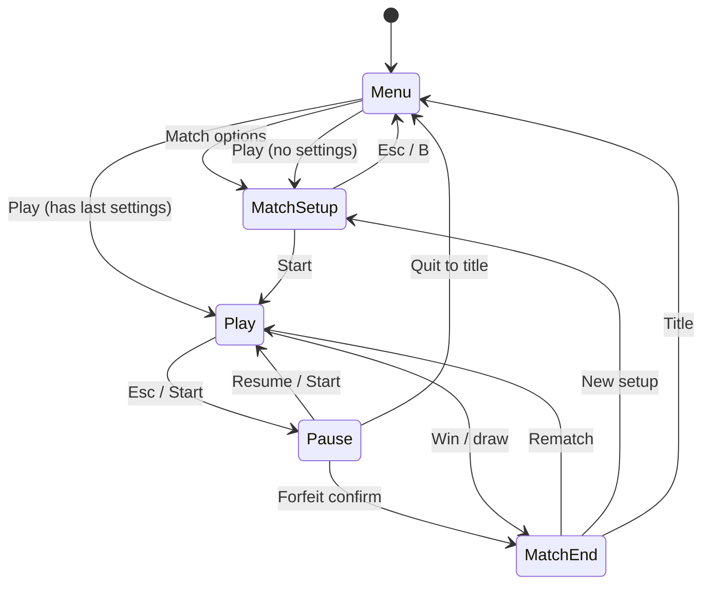

# LÖVE UX Design — Moles (Worms-style clone)

**Agent:** `love-ux`  
**Scope:** Screens, HUD, input affordances, resolution/scaling, focus/navigation — not combat math or physics (Game Designer / LÖVE Architect).  
**Traceability:** `REQUIREMENTS.md` R1–R11; root **`DESIGN.md`** checklist.

**Orchestrator / `DESIGN.md` merge:** Sections **§2–§8** (resolution through components), **§11** (JSON), and **§12** (crosswalk) are the **self-contained LÖVE UX chapter** to paste under e.g. **`## LÖVE UX — Screens, HUD, flows, and input`**. §0–§1 and §9–§10 are handoff to coders. **Do not truncate** wireframe tables, §4 flows, §5–§6, or §8 when merging.

**As-implemented baseline (this revision):** The repo contains working menus, match setup, play HUD, pause, match end, `viewport` letterboxing, and assets under **`assets/sprites/`**. Wireframes below list **observed layout** from **`src/ui/hud.lua`** and **`src/scenes/*.lua`** first, then **optional polish** deltas.

---

## 0. Codebase baseline (authoritative files)

| Area | Files |
|------|--------|
| Boot / stack | **`main.lua`** → **`src/app.lua`** (`push`/`pop`/`goto`, `gamepadpressed` **Start** toggles pause on **`play`** / **`pause`**) |
| Logical UI space | **`src/util/viewport.lua`** — fixed **1280×720** logical; uniform scale + letterbox (matches **`conf.lua`**) |
| Global HUD | **`src/ui/hud.lua`** — sky background, turn banner, session chips, weapon panel, wind panel, **help strip**, roster |
| Scenes | **`src/scenes/menu.lua`**, **`match_setup.lua`**, **`play.lua`**, **`pause.lua`**, **`match_end.lua`** |
| Menu gamepad | **`src/util/gamepad_menu.lua`** — first connected gamepad, D-pad / left stick + **0.22 s** cooldown |
| Play input | **`src/input/input_manager.lua`**, **`keyboard_mouse.lua`** (`shared_kb`), **`gamepad.lua`** (`dual_gamepad`, **20%** stick deadzone) |
| Data | **`src/data/match_settings.lua`**, **`src/data/session_scores.lua`** |
| Tuning / colors | **`src/config.defaults.lua`** — `colors.team1` / `team2`, `weapon.*`, `wind_force.*` |
| Sim (HUD truth) | **`src/sim/turn_state.lua`**, **`src/sim/world.lua`** — turn banner + toast use `world.turn`, `world.moles`, `world.settings` |
| Art manifest | **`ASSETS.md`** — sprite paths, suggested scales, HUD icon sizes |

**Session score call sites:** Normal win: **`play.lua`** calls **`session_scores.record_match_outcome`** then **`app.end_match`**. Forfeit: **`pause.lua`** → **`app.quit_match_to_results`** (also records in **`app.lua`**). **`match_end`** only **displays** `get_snapshot()`.

---

## 1. High-level architecture (UX layer)

### 1.1 Design intent

- **Readable in motion:** HUD uses dark translucent panels + team dots; phase line explains “one shot / reposition / resolving” (`hud.turn_phase`).
- **Two players, one screen:** Turn banner + **turn handoff toast** (`play.lua`) remove ambiguity about who acts.
- **Match variables:** Single **`match_setup`** list bound to **`match_settings`** (validate on **Start**).
- **Honest session scores:** Title + in-match top-right + **match_end** show the same snapshot fields.

### 1.2 Scene ids ↔ modules

| UX id | Module | Notes |
|--------|--------|--------|
| `scene_title` | `scenes/menu.lua` | Play / Match options / How to play / Quit |
| `scene_match_setup` | `scenes/match_setup.lua` | Vertical option rows (not two-column in v1) |
| `scene_gameplay` | `scenes/play.lua` | World draw + HUD + toast |
| `overlay_pause` | `scenes/pause.lua` | Pushed on stack over play |
| `scene_match_results` | `scenes/match_end.lua` | Shown via `app.end_match` after pop |

### 1.3 View model (UI reads)

- **`session_scores.get_snapshot()`** → `gamesPlayedP1`, `gamesPlayedP2`, `gamesDrawn`, `games_played`.
- **`match_settings`** validated table on `world.settings` in play.
- **`world.turn`:** `active_player`, `mole_slot[1|2]`, `turn_time_left`; **`hud.draw_turn_banner`** uses **`turn:active_mole(world.moles)`** for HP.
- **Weapon / aim:** `world.weapon_index`, `world.aim_angle`, `world.power`, `world.projectiles` (live grenade fuse line in weapon panel).

---

## 2. Resolution, scaling, and safe areas

- **Logical:** **1280 × 720** (`conf.lua` + `viewport.LW/LH`).
- **Minimum window:** **960 × 540** (`conf.lua`).
- **Scaling:** `viewport.fit_transform()` — uniform `s = min(w/LW, h/LH)`, offsets `ox, oy`; all menu/HUD draws assume logical coordinates inside **`app.draw`**’s translate/scale.
- **Safe margin:** Keep critical controls **≥ 24 px** inside logical edges; roster + help strip already sit above bottom **108 + 64** stack — avoid stacking more permanent chrome below **y ≈ 520** without overlapping **`draw_help_strip`** (**y 532–596**).

---

## 3. Wireframes — pixel regions (as implemented, 1280 × 720)

### 3.1 `scene_title` (`menu.lua`)

| Region (x, y, w, h) | Element |
|---------------------|---------|
| (0, 0, 1280, 720) | `hud.draw_background()` + dim overlay **α 0.35** |
| (440, 180, 400, ~80) | Title **MOLES** (shadow + main) |
| (440, 420, 400, 56×4) | Four menu rows, **68 px** vertical pitch, **56 px** row height, **400×56** hit area |
| (36, 36, 520, 100) | Session panel: *This session* + `P1 wins · P2 wins · Draws` |
| (400, 600, 480) / (840, 612, 400) | Tiny footer hints (gamepad / LÖVE blurb) |

**Focus order:** Play → Match options → How to play → Quit. **Keyboard:** Up/Down or W/S; Enter/Space activate. **Gamepad:** `gamepad_menu` up/down; **A** activate. **How to play:** full-screen modal; Esc / Enter / **A** / **B** close.

**Play:** Uses **`app.last_match_settings`** → **`goto play`** else **`goto match_setup`**.

---

### 3.2 `scene_match_setup` (`match_setup.lua`)

**Layout:** Single **centered list** (not two P1/P2 columns in current build).

| Region | Element |
|--------|---------|
| (48, 28, —) | Title *Match setup* |
| (48, 78, —) | Breadcrumb *Title ▸ Setup* |
| (40, 120, 1180, 52) × **9 rows** | Option rows, **60 px** vertical step; selected row `›` prefix |
| (48, ~668+) | Footer: *Enter / A: start · Esc / B: title · Arrows / D-pad · Left/Right: value · Seed: digits* |
| (48, below list) | **Warning** if `dual_gamepad` and `< 2` joysticks |

**Rows (order = focus order):** Roster size (readonly) → Mole health (step 10) → First turn (cycle 1/2/random) → Friendly fire → Turn limit (preset ladder 0,30,60,…) → Map seed (text buffer) → Input mode (toggle) → Wind (cycle).

**Keyboard:** Up/Down/W/S focus; Left/Right/A/D change value; Enter starts; Esc → menu; **textinput** digits on seed row only. **Gamepad:** nav up/down; left/right value; **A** start; **B** menu.

**Optional UX polish (not required for parity):** Two-column “team preview” mirroring original spec; device assignment per player instead of global `input_mode`.

---

### 3.3 `scene_gameplay` — HUD (`hud.lua` + `play.lua`)

| Region (x, y, w, h) | Function / content |
|---------------------|---------------------|
| (20, 10, 600, 96) | **`draw_turn_banner`** — team dot, Player N · Team A/B, active slot, HP, **phase** text @ x≈320, **turn timer** if enabled |
| (636, 10, 624, 96) | **`draw_session_line`** — three chips P1 wins / P2 wins / Draws + *Matches finished* |
| (20, 114, 328, 200) | **`draw_weapon_panel`** — `ui_icon_rocket` / `ui_icon_grenade` (~0.42 scale), weapon blurb, aim °, power bar; grenade fuse copy + **live grenade** fuse bar when flying |
| (932, 114, 328, 200) | **`draw_wind_timer`** — `ui_icon_wind` when wind on, direction text + large arrow glyph; note if turn limit enabled |
| (24, 532, 1232, 64) | **`draw_help_strip`** — one-line **shared_kb** vs **dual_gamepad** cheat sheet |
| (20, 604, 1240, 108) | **`draw_roster`** — Team A row @ y≈612, Team B @ y≈658; slots **118 px** apart, **108×40** cells, HP bar + numeric HP, **gold outline** active slot |
| (400, 312, 480, 56) | **Turn toast** (`play.lua`) — *Next: Player i · Mole slot j* (**~1.65 s**) |

**Element inventory:** Gradient sky (world backdrop); all HUD panels rounded rects **α 0.5** black; team colors from **`config.defaults`**.

**Optional polish:** Trajectory preview styling beyond current aim preview (`mole_draw.draw_aim_preview`); dedicated `MapMetaView` line for seed during play.

---

### 3.4 `overlay_pause` (`pause.lua`)

| Region | Element |
|--------|---------|
| (0, 0, 1280, 720) | Dim **α 0.42** |
| (380, 180, 520, 360) | Panel; *Paused*; four rows **52 px** pitch: Resume · How to play · Forfeit · Quit to title |

**Forfeit:** Selecting **Forfeit** sets **`forfeit_confirm`**; banner *Press Enter / A to confirm*; **Esc** / **B** cancels confirm. Confirm → opponent wins → **`quit_match_to_results`**.

**Keyboard:** Up/Down, Enter activate; Esc = back/pop. **Gamepad:** **B** = back or pop; **A** activate; **Start** (in **`app`**) pops pause when top is pause.

---

### 3.5 `scene_match_results` (`match_end.lua`)

| Region | Element |
|--------|---------|
| (0, 0, 1280, 720) | Dim **α 0.55** |
| (240, 80, 800, 520) | Card: headline (winner or Draw), session totals, **Map seed used** |
| (260, 460, 760) | Footer: *Enter / A: Rematch · S / X: New setup · Esc / B: Title* |

---

## 4. User flows (step-by-step)

### 4.1 Cold start → match

1. **`app.load`** → push **`menu`**.
2. **Match options** → **`match_setup`** → edit draft → **Enter / A** → `match_settings.validate` → **`play`** with settings.
3. **Play** (title): if **`last_match_settings`** → **`play`**; else **`match_setup`**.

### 4.2 In-match

1. **`play.update`:** intents from **`input_manager`** (mode-dependent); mouse aim only when **`shared_kb`** + `viewport.screen_to_logical`.
2. Turn change detection → **toast** 1.65 s.
3. **`world.won`** → **`record_match_outcome`** → **`end_match`** → stack cleared → **`match_end`** with winner, settings, `map_seed_used`.

### 4.3 Pause

**Esc** (play) or **Start** (gamepad, `app.gamepadpressed`) → **`pause`** pushed. Resume pops; Quit to title **`goto menu`**.

### 4.4 Forfeit

Pause → Forfeit → confirm → **`quit_match_to_results(other_player, settings)`** → **`match_end`**.

### 4.5 Match end

**Rematch** → **`goto play`** same settings. **New setup** → **`match_setup`** (**S** or gamepad **X**). **Title** → **`menu`** (**Esc** / **B**).

### 4.6 State diagram



---

## 5. Input mappings and interactions (as coded)

### 5.1 Modes

| `match_settings.input_mode` | Module |
|-----------------------------|--------|
| `shared_kb` | **`keyboard_mouse.lua`** + mouse click via **`input_manager:mousepressed`** |
| `dual_gamepad` | **`gamepad.lua`** — `getJoysticks()[1]` = P1, `[2]` = P2 |

Only the **active** player’s keyboard block is polled each frame (`turn_state.active_player`).

### 5.2 Shared keyboard + mouse

| Action | Player 1 (when active) | Player 2 (when active) |
|--------|-------------------------|-------------------------|
| Move | A / D | Left / Right |
| Jump | W or **Space** | Up or **Right Shift** |
| Aim adjust | Q / E | `[` / `]` |
| Power adjust | Z / X | **K** (down) / **I** (up) |
| Fire | **F** | **;** or **Right Ctrl** or **Return** or **Keypad Enter** |
| End turn | **G** | **Backspace** or **\\** |
| Weapon direct | **1** rocket, **2** grenade | **,** rocket, **.** grenade |
| Cycle weapon | **Tab** | **-** / **=** |
| Aim + fire (mouse) | **Left click** → same as fire for **active** player only | (when P2 active, same mouse) |

**Note:** **Space** is **jump** for P1 when active, not fire; keyboard fire uses **F** / P2 keys above. **`love.mousepressed` button 1** sets **`consume_mouse_fire`** for the active player.

### 5.3 In-match gamepad (per active player’s stick)

| Action | Mapping |
|--------|---------|
| Move | Left stick X (**20%** deadzone) |
| Jump | **A** |
| Aim | Right stick → absolute aim angle when non-zero |
| Power | **Right trigger − left trigger** |
| Fire | **B** |
| End turn | **Y** |
| Cycle weapon | **LB** / **RB** |

### 5.4 Global / menu gamepad

- **`app.gamepadpressed`:** **Start** on **`play`** → pause; **Start** on **`pause`** → pop (resume).
- **Menus** (`menu`, `match_setup`, `pause`, `match_end`): first gamepad with **`gamepad_menu`**; **A** confirm; **B** back where implemented; **match_end** **X** = new setup.

### 5.5 Menus (keyboard)

- **menu:** Up/Down, Enter/Space.
- **match_setup:** arrows/W/S, Left/Right, Enter start, Esc menu.
- **pause:** same pattern as menu + forfeit confirm branch.

---

## 6. Accessibility & readability

- **Contrast:** Light text on **dark translucent** panels (implemented); keep **≥ 4.5:1** for any new panels.
- **P1/P2:** Banner uses **Player N** + **Team A/B** + **color dot** — not color-only.
- **Fonts:** `app.load` sets **40 / 20 / 17 / 14** pt-ish fonts for title/HUD/small/tiny; maintain **≥ 22 px** effective for critical HUD numbers if font file changes.
- **Motion:** Toast is short; optional “reduce motion” could disable toast or camera shake (if added later).
- **In-world:** See **`ASSETS.md`** — mole/projectile scales; team-readable palette aligns with **`defaults.colors`**.

---

## 7. File / directory structure (UX-relevant, current)

```
assets/sprites/          # mole_*, rocket, grenade, ui_icon_*  (see ASSETS.md)
src/app.lua
src/scenes/menu.lua
src/scenes/match_setup.lua
src/scenes/play.lua
src/scenes/pause.lua
src/scenes/match_end.lua
src/ui/hud.lua
src/util/viewport.lua
src/util/gamepad_menu.lua
src/input/input_manager.lua
src/input/keyboard_mouse.lua
src/input/gamepad.lua
src/data/match_settings.lua
src/data/session_scores.lua
src/config.defaults.lua
```

**Reasonable additions (optional):** `assets/fonts/`, `src/ui/widgets/*.lua` if splitting `hud.lua`; **`assets/audio/`** per **`src/audio/sfx.lua`** / README.

---

## 8. Component breakdown (map to code)

| Spec name | Implementation anchor |
|-----------|------------------------|
| `SessionScoreChip` | `hud.draw_session_line`; `menu` session rect |
| `MatchSettingsForm` | `match_setup` rows + `draft` table |
| `TurnBanner` | `hud.draw_turn_banner` |
| `WeaponPanel` | `hud.draw_weapon_panel` |
| `WindReadout` | `hud.draw_wind_timer` |
| `HelpStrip` | `hud.draw_help_strip` |
| `RosterBar` | `hud.draw_roster` |
| `TurnToast` | `play.lua` toast_t / toast_msg |
| `PauseMenu` | `pause.lua` |
| `MatchResultsPanel` | `match_end.lua` |
| `HowToPlayOverlay` | `show_howto` in `menu.lua` / `pause.lua` |
| `GamepadMenuNav` | `util/gamepad_menu.lua` |

---

## 9. Dependencies & technology

- **LÖVE 11.4**; **nearest** filtering on sprites (`app.load`).
- **Procedural SFX** `src/audio/sfx.lua` (optional recorded assets later).

---

## 10. Implementation notes for Coding Agent

1. **HUD changes:** Edit **`src/ui/hud.lua`** only for layout/constants; keep **`viewport`** logical coords consistent with **`app.draw`** transform.
2. **New HUD rows:** Avoid overlapping **y 532–716** band (help + roster) without resizing **`draw_roster`** / **`draw_help_strip`**.
3. **Input docs:** Keep **`README.md`** in sync with **`keyboard_mouse.lua`** / **`gamepad.lua`** (source of truth).
4. **match_setup UX:** If adding columns, preserve **`match_settings.validate`** on commit.
5. **Forfeit / win:** Do not double-call **`record_match_outcome`** for the same match (current paths: win in `play`, forfeit in `quit_match_to_results`).

---

## 11. Structured handoff JSON

```json
{
  "userFlows": {
    "title": ["Menu → Play | MatchSetup | HowTo | Quit"],
    "setup": ["Rows: health, first, FF, timer, seed, input, wind → Enter/A → Play"],
    "play": ["HUD + toast; Esc/Start → Pause; win → MatchEnd"],
    "pause": ["Resume | HowTo | Forfeit+confirm | QuitToTitle"],
    "results": ["Rematch | NewSetup(S/X) | Title(Esc/B)"]
  },
  "wireframes": {
    "logicalSize": [1280, 720],
    "hud": {
      "turnBanner": [20, 10, 600, 96],
      "sessionLine": [636, 10, 624, 96],
      "weaponPanel": [20, 114, 328, 200],
      "windPanel": [932, 114, 328, 200],
      "helpStrip": [24, 532, 1232, 64],
      "roster": [20, 604, 1240, 108],
      "turnToast": [400, 312, 480, 56]
    },
    "pauseModal": [380, 180, 520, 360],
    "matchEndCard": [240, 80, 800, 520]
  },
  "interactions": {
    "shared_kb": "§5.2",
    "dual_gamepad_play": "§5.3",
    "startButton": "pause toggle via app.gamepadpressed",
    "menuGamepad": "gamepad_menu first pad; A confirm; B back"
  },
  "accessibility": "§6",
  "assets": "ASSETS.md"
}
```

---

## 12. Requirements crosswalk

| Req | UX evidence |
|-----|-------------|
| R1 | `ASSETS.md`, `hud` styling, `mole_draw` |
| R2–R3 | Weapon panel + world projectiles |
| R4 | Turn banner, toast, hotseat |
| R5 | Seed in setup + match_end *Map seed used* |
| R6 | `session_scores` + HUD + match_end |
| R7–R8 | Roster slots; `turn_state` + toast |
| R9 | `match_setup` rows |
| R10 | §5.2 + help strip |
| R11 | §5.3 + dual warning |

---

*End of love-ux design document.*
