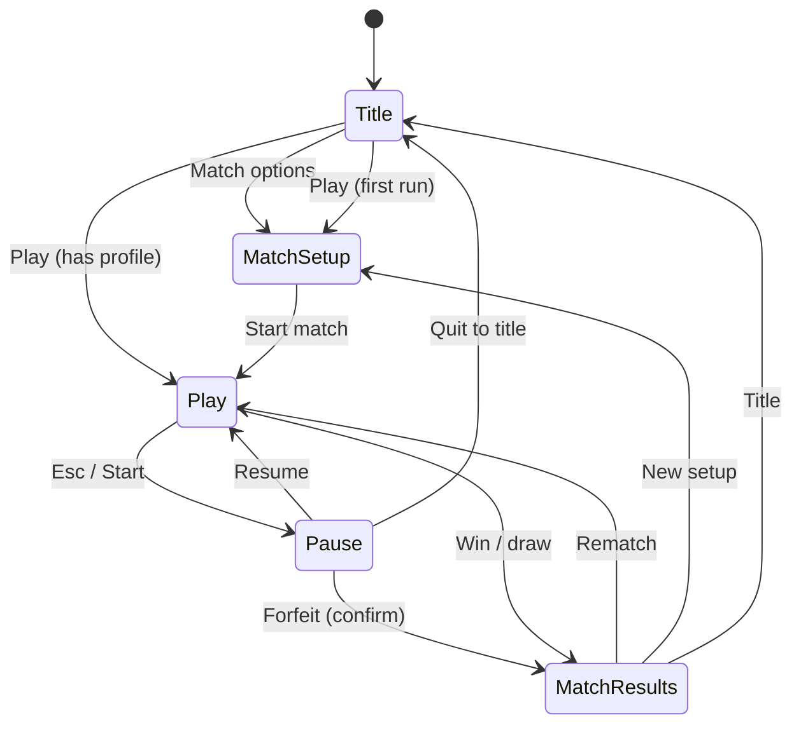

# LÖVE UX Design — Moles (Worms-style clone)

**Agent:** `love-ux`  
**Scope:** Screens, HUD, input affordances, resolution/scaling, focus/navigation — not combat math or physics (Game Designer / LÖVE Architect).  
**Traceability:** Maps to `REQUIREMENTS.md` R1–R11 and the checklist in root **`DESIGN.md`**.

**Orchestrator / merge note:** Sections **§2–§8** (resolution through components), **§11** (JSON), and **§12** (crosswalk) are intended to be copied into root **`DESIGN.md`** as a self-contained chapter (suggested heading: **`## LÖVE UX — Screens, HUD, flows, and input`**). §0–§1 and §9–§10 remain implementation handoff; include them in the merge if the merged doc should be fully self-contained for coders. **This file is the canonical source** — do not truncate wireframes, §4 flows, §5–§6 input/accessibility, or the component list when merging.

---

## 0. Codebase baseline (build on these files)

| File | UX relevance |
|------|----------------|
| **`conf.lua`** | Window **1280×720**, **min** **960×540**, resizable, vsync, identity `moles-wormslike`, title `Moles`, **LÖVE 11.4** — design anchors in §2 match this exactly. |
| **`main.lua`** | Thin callbacks; delegates to **`src/app.lua`** when present (Coding Agent). UI scenes: architect’s `src/scenes/` + `src/ui/`. |
| **`src/data/match_settings.lua`** | **Authoritative schema** for match-setup: `defaults()`, `validate()`, `merge_partial()`. UI commits only through this module. |
| **`src/data/session_scores.lua`** | Session wins/draws: `get_snapshot()`, `record_match_outcome(winner_id)`, `reset()`. |
| **`src/config.defaults.lua`** | Tuning + **`colors.team1` / `colors.team2`**, **`weapon.grenade_fuse`**, **`wind_force.low|med|high`** — HUD copy for wind/fuse can reference these for consistency (display labels, not raw numbers required). |
| **`src/sim/turn_state.lua`** | **Turn truth** for HUD: `active_player` (1\|2), `mole_slot[1]`, `mole_slot[2]`, `turn_time_left` / `_turn_limit`, `end_turn`, `update_timer`. **TurnView** (§1.3) must reflect this state after `sync_slots_to_living`. |
| **`src/sim/terrain_gen.lua`** | Procedural map (R5); surface **`map_seed`** from `match_settings` in **`MapMetaView`** when set. |
| **`src/sim/terrain.lua`**, **`damage.lua`**, **`physics.lua`** | In-world readability (hits, knockback, destruction) should emit **events** the HUD/effects layer can show (numbers optional; flash/shake per §6). |

**Pseudocode — UI ↔ data modules:**

```lua
local match_settings = require("data.match_settings")
local s = match_settings.merge_partial(last_settings, form_partial)

local session_scores = require("data.session_scores")
local snap = session_scores.get_snapshot()

session_scores.record_match_outcome(winner_id) -- 1, 2, or 0 draw
```

**Team colors (HUD):** `local defaults = require("config.defaults")` then `defaults.colors.team1`, `defaults.colors.team2`.

---

## 1. High-level architecture (UX layer)

### 1.1 Design intent

- **Readable in motion:** HUD and world feedback stay legible during camera pan, explosions, and turn transitions (R1).
- **Two local humans, zero ambiguity:** Always show *whose turn it is*, *which mole slot is active*, and *which input mode* applies (R4, R10, R11).
- **Match variables before play:** All **`match_settings`** fields editable in setup (R9).
- **Session score:** **`session_scores.get_snapshot()`** on title, HUD, results (R6).

### 1.2 Scene graph — UX ids ↔ architect scenes

| UX id | Architect scene | Lua hint |
|-------|-------------------|----------|
| `scene_title` | MainMenu | `src/scenes/menu.lua` |
| `scene_match_setup` | MatchSetup | `src/scenes/match_setup.lua` |
| `scene_gameplay` | Play | `src/scenes/play.lua` |
| `overlay_pause` | Pause | `src/scenes/pause.lua` |
| `scene_round_summary` | RoundEnd (optional) | `src/scenes/round_end.lua` |
| `scene_match_results` | MatchEnd | `src/scenes/match_end.lua` |

### 1.3 View model contract

**`SessionView`** — `session_scores.get_snapshot()`:

```text
gamesPlayedP1, gamesPlayedP2, gamesDrawn, games_played
```

**`MatchSettingsView`** — after `match_settings.validate()`:

```text
moles_per_team (fixed 5), mole_max_hp, first_player, friendly_fire,
turn_time_seconds, map_seed, input_mode ("shared_kb"|"dual_gamepad"), wind
```

**`TurnView`** — align with **`src/sim/turn_state.lua`**:

```text
active_player          -- 1 | 2
active_mole_slot       -- mole_slot[active_player], 1..5
inactive_mole_slots    -- optional: show opponent’s slot for context
turn_time_left         -- number; hide or show “∞” when turn_time_seconds == 0
phase                  -- move | aim | firing | resolving (labels for UX only; sim may collapse)
```

**`CombatHudView`:** `weapon: rocket|grenade`, `aim_angle`, `power_01`, `grenade_time_left` (live fuse) / `grenade_fuse_total` (from defaults for bar max).

**`RosterView`:** per player, slots 1..5: `hp_current`, `hp_max`, `alive`, optional `name`.

**`MapMetaView`:** `seed` if non-random; short label “Procedural map” if nil.

---

## 2. Resolution, scaling, and safe areas

### 2.1 Base logical resolution

- **`conf.lua`:** **1280 × 720**. All regions in §3 use this space.

### 2.2 Minimum window

- **960 × 540** — keep critical controls inside **safe margins** so nothing clips.

### 2.3 Safe margins

- **≥ 24 px** from edges for interactive HUD and primary copy.
- **≥ 48 px** for elements that must not clip under letterboxing on non-16:9 displays.

### 2.4 Scaling

- Uniform scale to logical 720p; letterbox/pillarbox as needed.
- Prefer crisp UI (canvas at logical size, scaled draw). **No illegible micro-text** on large monitors.

---

## 3. Wireframes — pixel regions (1280 × 720)

### 3.1 `scene_title` (MainMenu)

| Region (x, y, w, h) | Element |
|---------------------|---------|
| (0, 0, 1280, 720) | Full-bleed background, vignette |
| (440, 180, 400, 280) | Card: logo / wordmark **Moles** |
| (440, 420, 400, 140) | Vertical stack, **56 px** row height, **12 px** gap: **Play**, **Match options**, **How to play**, **Quit** |
| (40, 40, 520, 120) | **Session chip:** `P1 wins · P2 wins · Draws` + caption *This session* |
| (840, 600, 400, 80) | Version / credits (low contrast) |

**Element inventory:** background art layer; title card; four primary buttons; session stats block; footer line.

**Focus order:** Play → Match options → How to play → Quit. **Default:** Play.

**Play:** If no saved setup profile, **force** Match setup; else start with last validated **`match_settings`** and bindings.

---

### 3.2 `scene_match_setup` (MatchSetup)

| Region | Element |
|--------|---------|
| (40, 32, 1200, 64) | Header *Match setup*; breadcrumb `Title ▸ Setup` |
| (40, 112, 580, 520) | **Player 1** column — accent `team1` color |
| (660, 112, 580, 520) | **Player 2** column — accent `team2` color |
| (40, 656, 1200, 48) | Footer: **Back** (left), **Start match** (right, primary) |

**Per column**

1. **Input / mode copy** (see `input_mode`): `shared_kb` explains shared KB+M; `dual_gamepad` shows **Assigned: Gamepad A/B** or *Unassigned* + warning.
2. **Five mole pips** (slots 1–5), read-only preview.

**Match variables** (bind 1:1 to **`match_settings`**):

| Field | Control | Label |
|-------|---------|--------|
| `moles_per_team` | Read-only | “5 moles per team” |
| `mole_max_hp` | Stepper / chips | “Mole health” (10–500) |
| `first_player` | Segmented | “Who goes first?” P1 / P2 / Random |
| `friendly_fire` | Toggle | “Friendly fire” |
| `turn_time_seconds` | 0 + presets + numeric | “Turn limit” (0 = off, max 300) |
| `map_seed` | Text / empty | “Map seed (optional)” |
| `input_mode` | Two cards | “Shared keyboard & mouse” vs “Two gamepads” |
| `wind` | Segmented | Off / Low / Med / High |

**Focus model:** P1 column top→bottom → P2 column → globals (match variables) → footer. Optional **LB/RB** to jump P1↔P2 headers. **Default focus:** first control in P1 column (or `input_mode` if listed first in implementation).

---

### 3.3 `scene_gameplay` (Play) — HUD

| Region | Content |
|--------|---------|
| (24, 16, 600, 88) | **Turn banner:** `Player {n} — Mole {slot}` + team dot (colors from `config.defaults`) |
| (656, 16, 600, 88) | **Session line:** `P1 W · P2 W · D` |
| (24, 104, 340, 200) | **Weapon & aim:** icons rocket/grenade, angle, power bar; grenade **fuse** bar + seconds |
| (916, 104, 340, 200) | **Wind** (if not off): arrow + Low/Med/High; **turn countdown** if timer on |
| (24, 620, 1232, 76) | **Roster bar:** two groups × 5; HP per slot; dead = dim/grey |

**Element inventory:** turn + session; weapon panel; wind/timer; full roster; world-layer trajectory (rocket dashed line); grenade arc optional; active-mole **ring** in world + **2 px** roster highlight.

**Weapon UX:** selected = filled icon; other = outline. **Rocket:** high-contrast dashed trajectory + small impact marker. **Grenade:** visible **fuse pulse** (color or blink) matching danger.

---

### 3.4 `overlay_pause` (Pause)

- Dim world **~40%**.
- Modal **520 × 360** centered (e.g. x=380, y=180):

| Row | Control |
|-----|---------|
| 1 | **Resume** (default focus) |
| 2 | **How to play** |
| 3 | **Forfeit match** (destructive, secondary style) |
| 4 | **Quit to title** |

**Open:** Esc, Start (gamepad). **Close from Resume:** Esc, B/back.

---

### 3.5 `scene_match_results` (MatchEnd)

| Region | Content |
|--------|---------|
| (240, 80, 800, 120) | Headline: winner or Draw |
| (240, 220, 800, 280) | Stats: turns, survivors, duration (optional) |
| (240, 520, 800, 120) | **Rematch** · **New setup** · **Title** |

Ensure **`session_scores.record_match_outcome`** has run before or when this screen is shown; displayed totals must match **`get_snapshot()`** (R6).

---

### 3.6 `scene_round_summary` (optional)

Toast or full-screen **1.2–2 s:** e.g. *Next: Player 2 — Mole 3* for rotation clarity (R8).

---

## 4. User flows (step-by-step)

### 4.1 Cold start → first match

1. Launch → **`scene_title`** (session 0-0-0).
2. **Match options** → **`scene_match_setup`** → edit → **`match_settings.merge_partial`** → **Start match** → short load (“Digging tunnel…”) → **`scene_gameplay`**.
3. **Play** on title: last settings, or setup if none / first run.

### 4.2 In-match loop

1. Turn start → banner + roster highlight + camera on active mole (`turn_state.active_player`, `mole_slot`).
2. Move/aim → weapon panel + trajectory/fuse update.
3. Fire → **resolving** feedback; brief input lock.
4. Damage → HP bar animation; optional edge flash (team color).
5. End turn (player or timer) → sim calls **`end_turn`** → optional **`scene_round_summary`**.
6. Repeat until win condition.

### 4.3 Turn timer (when `turn_time_seconds` > 0)

- HUD shows **`turn_time_left`**.
- At 0, auto **end turn** (same UX as manual end: brief toast *Time’s up*).

### 4.4 Match end

1. Win/draw detected → short celebration (**≤ 2 s**) → **`scene_match_results`**.
2. Session chip on next **`scene_title`** reflects new totals.

### 4.5 Pause

**Gameplay** → Esc/Start → **`overlay_pause`** → Resume (return) | How to play | Forfeit | Quit to title.

### 4.6 Forfeit

**Forfeit match** → confirm dialog (recommended) → declare opponent winner → **`scene_match_results`** or compact **forfeit results** line → **`record_match_outcome`**.

### 4.7 Rematch / setup / title

- **Rematch:** same **`match_settings`**, new terrain (unless seed fixed), new **`turn_state`**, → **`scene_gameplay`**.
- **New setup:** → **`scene_match_setup`**.
- **Title:** → **`scene_title`**.

### 4.8 Dual gamepad gaps

If **`dual_gamepad`** and <2 pads: **warning**, offer switch to **`shared_kb`** or wait; never silent failure.

### 4.9 State diagram (high level)



---

## 5. Input mappings and interactions

### 5.1 `match_settings.input_mode`

| Value | Behavior |
|-------|----------|
| `shared_kb` | One keyboard + mouse; **mouse aim only for `turn_state.active_player`** (R10). |
| `dual_gamepad` | Two controllers; map joysticks to P1/P2 (R11). |

Show summaries on setup + **How to play**.

### 5.2 Shared keyboard + mouse

| Action | P1 | P2 |
|--------|----|----|
| Aim (mouse) | when active | when active |
| Aim left/right | A / D | Left / Right |
| Power up/down | W / S | Up / Down |
| Fire | Space | Right Ctrl or Enter (pick one) |
| Jump | Q | ] or Numpad 0 |
| Weapon | 1 / 2 or [ / ] | , / . |
| End turn (optional) | E | Numpad Enter |
| Pause | Esc | Esc |

**Tooltip (first session):** *Mouse aims the active player only.*

### 5.3 Gamepad (each player)

| Action | Map |
|--------|-----|
| Aim | Left stick |
| Fine aim | D-pad L/R |
| Power | Triggers (preferred) or R-stick vertical |
| Fire | South face |
| Weapon | LB / RB |
| End turn | Y / Triangle (optional) |
| Pause | Start |

**How to play:** ~**15%** dead zone note.

### 5.4 Global

Quit from title; **Quit to title** from pause.

### 5.5 Menu / setup navigation (controller)

- **A / cross:** activate.
- **B / circle:** back (setup footer **Back**, pause dismiss when on Resume).
- **D-pad / stick:** move focus.
- **Default focus** per screen as in §3.

---

## 6. Accessibility & readability

- **Contrast:** UI text **≥ 4.5:1** on panels; stroked or chip-backed turn text.
- **P1/P2:** always **text labels**; color is secondary (left/right or icon shape).
- **Type scale (logical px):** body **18–20**, HUD numbers **≥ 22**, title **≥ 36**.
- **Reduce motion** (optional future toggle): shorten toasts, disable camera shake.
- **In-world:** mole + projectile **silhouette/outline**; explosion **1–2** bright frames; damage **optional floating numbers** (off by default if busy).

---

## 7. File / directory structure (UX-facing)

**Present in repo:** `conf.lua`, `main.lua`, `src/config.defaults.lua`, `src/data/match_settings.lua`, `src/data/session_scores.lua`, `src/sim/*`, `src/util/*`.

**Typical additions (architect-aligned):**

```text
assets/fonts/
assets/ui/
src/app.lua
src/scenes/menu.lua
src/scenes/match_setup.lua
src/scenes/play.lua
src/scenes/pause.lua
src/scenes/match_end.lua
src/scenes/round_end.lua   # optional
src/ui/hud.lua
src/ui/widgets/
src/input/input_manager.lua
```

UI must **not** reimplement **`match_settings.validate`** — commit via **`merge_partial`**.

---

## 8. Component breakdown (responsibilities)

| Component | Role |
|-----------|------|
| `SessionScoreChip` | `session_scores.get_snapshot()` |
| `MatchSettingsForm` | Edits §3.2 fields → partial for `merge_partial` |
| `InputModeSelector` | `input_mode` + device warnings |
| `TurnBanner` | `TurnView` + team colors |
| `TurnTimerReadout` | `turn_time_left` / hidden if off |
| `WindReadout` | `match_settings.wind` + wind rose |
| `WeaponPanel` | `CombatHudView` |
| `RosterBar` | `RosterView` |
| `PauseMenu` | §3.4 |
| `ConfirmDialog` | Forfeit (recommended) |
| `MatchResultsPanel` | §3.5 + session update |
| `HowToPlayOverlay` | KB + gamepad diagrams |
| `LoadingBanner` | “Digging tunnel…” between setup and play |

---

## 9. Dependencies & technology

- **LÖVE 11.4** (`conf.lua`).
- **≤ 2 font families** (display + UI).

---

## 10. Implementation notes for Coding Agent

1. Route **mouse** to aim only when **`input_mode == shared_kb`** and local player == **`turn_state.active_player`**.
2. **Focus:** menus use UI focus; **Play** uses world input unless pause.
3. **Draw order:** Pause > toasts > HUD > world.
4. Roster **slot index** is stable identity (R7/R8).
5. **`record_match_outcome`** once per match end / forfeit.
6. Colors: **`require("config.defaults").colors.team1` / `team2`**.
7. **`main.lua`** forwards joystick events — pause on **Start** for active gamepad side when in Play.

---

## 11. Structured handoff JSON

```json
{
  "userFlows": {
    "coldStart": ["Title → MatchSetup → validate → Play", "Title → Play if profile exists"],
    "inMatch": ["Turn HUD → move/aim → fire → resolve → end turn → next"],
    "timer": ["turn_time_left visible; at 0 auto end_turn + toast"],
    "pause": ["Esc|Start → Pause → Resume|HowToPlay|Forfeit|Quit"],
    "forfeit": ["Confirm → opponent wins → MatchResults → record_match_outcome"],
    "matchEnd": ["Win/draw → MatchResults → Rematch|Setup|Title"]
  },
  "wireframes": {
    "baseResolution": [1280, 720],
    "minWindow": [960, 540],
    "scene_title": { "sessionChip": [40, 40, 520, 120], "actions": [440, 420, 400, 140], "titleCard": [440, 180, 400, 280] },
    "scene_match_setup": { "p1": [40, 112, 580, 520], "p2": [660, 112, 580, 520], "footer": [40, 656, 1200, 48], "header": [40, 32, 1200, 64] },
    "scene_gameplay": { "turnBanner": [24, 16, 600, 88], "session": [656, 16, 600, 88], "weapon": [24, 104, 340, 200], "windTimer": [916, 104, 340, 200], "roster": [24, 620, 1232, 76] },
    "overlay_pause": { "modal": [380, 180, 520, 360] },
    "scene_match_results": { "headline": [240, 80, 800, 120], "stats": [240, 220, 800, 280], "actions": [240, 520, 800, 120] }
  },
  "interactions": { "inputModes": ["shared_kb", "dual_gamepad"], "kbm": "§5.2", "pad": "§5.3", "menuNav": "§5.5" },
  "accessibility": "§6",
  "components": "§8"
}
```

---

## 12. Requirements / DESIGN.md crosswalk

| Req | UX |
|-----|-----|
| R1 | §1.1, §3.3, §6 |
| R2–R3 | §3.3 |
| R4 | §3, §4 |
| R5 | §1.3 MapMetaView, `map_seed` |
| R6 | §0, §3.1, §3.5, §10 |
| R7–R8 | §3.2–3.3, §4, `turn_state` |
| R9 | §3.2 |
| R10–R11 | §5 |

---

## 13. Merge checklist for root `DESIGN.md` (orchestrator)

When merging into **`DESIGN.md`**, ensure the following **subsections** exist verbatim (same technical content; headings may be renumbered):

1. **Resolution & safe areas** — §2  
2. **Wireframes** — full §3 including **element inventories** and pause/results modals  
3. **User flows** — full §4 including **mermaid** diagram, pause, forfeit, rematch  
4. **Input** — §5 (all subsections)  
5. **Accessibility** — §6  
6. **UI file tree & components** — §7–§8  
7. **Optional:** §11 JSON for tooling  

Do **not** merge only a one-paragraph summary; that was the source of an incomplete unified design.

---

*End of love-ux design document.*
