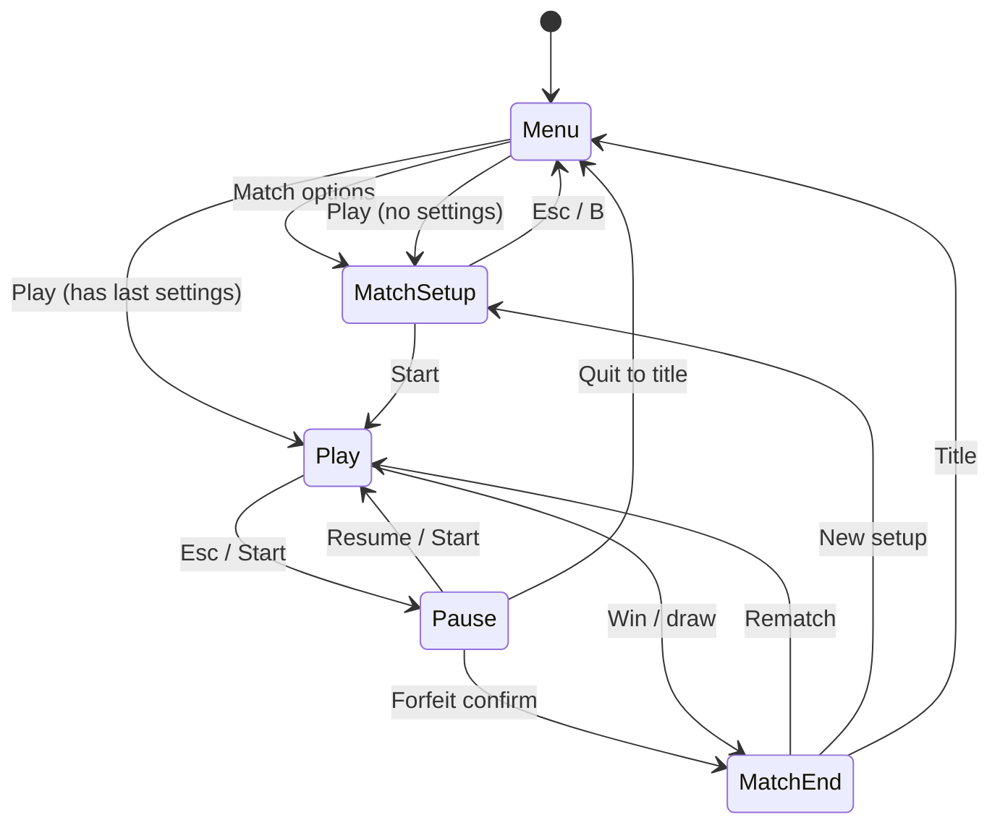

## Original task (source of truth)

Create a beautifully styled 'moles' clone of the game 'worms' that implements the core game mechanics, including rocket launchers and grenades. The game should support 2 player local mode with procedurally generated maps, keep track of scores of games played since launching, and allow teams of 5 moles per player, rotating players and moles each round. Include options for players to set match variables like mole health and support for 2 players on a single keyboard/mouse or with separate controllers.

---


## Requirements traceability

Numbered requirements extracted from the user task: **[REQUIREMENTS.md](./REQUIREMENTS.md)**. Implementation must satisfy each item or document deferral in **CODING_NOTES.md**.

<!-- requirements-traceability-linked -->

---


## Requirements traceability

Implement every item in **[REQUIREMENTS.md](./REQUIREMENTS.md)** (R1–R11) or document deferral in **[CODING_NOTES.md](./CODING_NOTES.md)**.

### REQUIREMENTS.md (verbatim)

# Requirements

Extracted from the user task for traceability (design, coding, review).

- **R1** (presentation): Create a beautifully styled clone of the game 'worms' with core game mechanics.
- **R2** (combat): Implement rocket launchers as a weapon option.
- **R3** (combat): Implement grenades as a weapon option.
- **R4** (input): Support 2 player local mode.
- **R5** (combat): Generate procedurally generated maps for gameplay.
- **R6** (persistence): Keep track of scores of games played since launching.
- **R7** (combat): Allow teams of 5 moles per player.
- **R8** (combat): Rotate players and moles each round.
- **R9** (combat): Provide options for players to set match variables like mole health.
- **R10** (input): Support 2 players on a single keyboard/mouse.
- **R11** (input): Support 2 players with separate controllers.


---

## Merged document structure

This file merges **`.pipeline/game-designer-design.md`**, **`.pipeline/love-ux-design.md`**, and **`.pipeline/love-architect-design.md`**.

- **Normative turn and mole rotation:** **Part A — Turn model** pseudocode overrides any conflicting prose in Parts B or C.
- **As-built notes:** Pipeline UX/Designer docs reference the current repo (`src/`, `assets/`, `CODING_NOTES.md`, `README.md`, `ASSETS.md`).

---

## Part A — Game Designer
**Audience:** merge into `DESIGN.md` + Coding Agent blueprint  
**Framework:** LÖVE **11.4**  
**Repo baseline (implemented):** `REQUIREMENTS.md` (R1–R11) · `CODING_NOTES.md` (UX/designer drift + env notes) · `ASSETS.md` (sprite scale manifest) · `README.md` (player-facing controls). Entry `main.lua` → `src/app.lua` (scene stack). **Sim:** `src/sim/world.lua`, `mole.lua`, `turn_state.lua`, `terrain.lua`, `terrain_gen.lua`, `physics.lua`, `damage.lua`, `src/sim/weapons/{registry,rocket,grenade}.lua`. **Flow:** `src/scenes/{menu,match_setup,play,pause,match_end}.lua`. **Input:** `src/input/{input_manager,keyboard_mouse,gamepad}.lua`. **Presentation:** `src/render/{camera,terrain_draw,mole_draw}.lua`, `src/ui/hud.lua`, `src/audio/sfx.lua`. **Data:** `src/data/match_settings.lua`, `session_scores.lua` · **Tuning:** `src/config.defaults.lua`. Merged umbrella spec: root `DESIGN.md`.

---

## requirementsChecklist

Traceability: one bullet per distinct requirement from the user task and BigBoss brief. Coder ticks when implemented.

- [ ] **R-presentation**: Game is a **beautifully styled** presentation of a Worms-like experience (visual identity, readable entities, cohesive art direction — execution by art/UX; mechanics support clarity).
- [ ] **R-clone-scope**: Delivers a **“moles” clone** of **Worms** in spirit: side-view, destructible terrain, indirect weapon fire, turns, elimination win.
- [ ] **R-core-mechanics**: **Core Worms-style mechanics** present: terrain, gravity, movement/jumps, aiming, firing, damage, knockback, elimination, turn flow.
- [ ] **R-rocket**: **Rocket launcher** is a selectable weapon with distinct behavior (fast projectile, impact explosion, terrain destruction).
- [ ] **R-grenade**: **Grenade** is a selectable weapon with distinct behavior (arc trajectory, timed fuse, bounce optional, explosion + terrain destruction).
- [ ] **R-2p-local**: **Two-player local** multiplayer (same machine, hotseat or split attention as per input mode).
- [ ] **R-proc-maps**: **Procedurally generated maps** for each match (or per session rule — default: new terrain each new game), reproducible via seed for debugging/fairness.
- [ ] **R-session-score**: **Scores for games played since app launch** tracked (session-only persistence per REQUIREMENTS; reset on quit).
- [ ] **R-team-size**: Each human controls a **team of 5 moles**.
- [ ] **R-rotate-turns**: **Players alternate turns** each “turn” (standard Worms cadence: one team acts, then the other).
- [ ] **R-rotate-moles**: **Moles rotate** per roster slot: when a player **ends their turn**, **that player’s** slot pointer advances to the **next living mole** in fixed order 1..5 (ring, skip dead) — symmetric same-slot pacing with the opponent; see **Turn model** pseudocode.
- [ ] **R-match-vars**: **Match options** exposed before play (at minimum **mole max health / starting health**; room for more toggles without contradicting scope).
- [ ] **R-input-shared-kbm**: **Two players on one keyboard + mouse**: viable control scheme with clear ownership of input per active turn.
- [ ] **R-input-dual-pad**: **Two players with separate controllers** (gamepads): each player mapped to their own device where possible.
- [ ] **R-bigboss-teams**: Design supports **team dynamics**: two sides, friendly-fire policy, win when opposing team has no living moles, clarity of “which side am I on.”
- [ ] **R-bigboss-rotation**: Explicit **player + mole rotation** model documented and implemented (see **Turn model** below).

---

## targetLoveVersion

`11.4` — match wiki/API stability used across the pipeline.

---

## mechanics

### High-level pitch

**Moles** is a **2D side-view**, **turn-based** artillery/tactics game. Two human players each command **5 moles** on **destructible procedural terrain**. On a turn, the active player moves and fires **one weapon** (from a small loadout including **rocket launcher** and **grenade**). The match ends when one side has **no living moles**. **Session score** records how many **match wins** each player (or each team slot) has earned **since the executable started**.

### Camera / world

- **Side view** (Worms-like): gravity pulls downward; terrain is a bitmap or polygon mask treated as solid for collisions.
- **Scale**: moles readable at target resolution (~32–48 px tall baseline suggestion for art; coder scales consistently).

### Turn model (players + moles rotation)

**Normative rule:** The **`on_end_turn` / `advance_mole_index` pseudocode block below is authoritative** for turn and mole rotation. Any prose in other pipeline docs (e.g. LÖVE Architect) that implies advancing the **opponent’s** roster when a turn ends, or advancing a roster when a turn **starts**, is **out of date** — implement the pseudocode. **Where merged architecture prose (e.g. `DESIGN.md`, LÖVE Architect) disagrees with this Turn Model, this pseudocode overrides it for player/mole rotation; align `src/sim/turn_state.lua` (and callers) to the pseudocode, not the conflicting paragraph.**

**One-line precedence:** *Turn Model pseudocode overrides conflicting architecture prose whenever they disagree on player/mole rotation.*

**Code alignment:** `src/sim/turn_state.lua` is written to this model (`advance_after_turn` / `end_turn`); `world.lua` should keep calling `sync_slots_to_living` after damage/death so the active slot never points at a dead mole mid-turn (see `CODING_NOTES.md`).

**Product intent — symmetric same-slot progression:** Each human alternates as **turn owner**. Each player’s **roster slot index** (1..5) advances **only when that player ends their own turn**, so after a full **player–player cycle** (P1 acts, then P2 acts), **both** teams have stepped forward one **living** mole in lockstep when no asymmetrical deaths have occurred — i.e. both sides stay on the **same slot number** relative to their rosters (both on “slot 2” for their next respective turns, etc.). Deaths desync indices by skipping dead moles per `advance_mole_index`.

1. **Turn owner**: Exactly one **human player** is active at a time (`PlayerId` 1 or 2).
2. **Active mole**: The active player controls **one mole** for the entire turn — the **current index** in that player’s roster (1..5).
3. **End of turn**: Triggered explicitly by player (**“End turn”** action) or optionally by **timeout** if match options include turn timer (recommended as optional match var, default off for first implementation).
4. **Handoff to opponent**: When the active player ends their turn, **only the ended player’s** roster pointer is advanced (see pseudocode); the opponent’s `mole_index` **does not change** at that moment. Turn ownership passes to the other player.
5. **Skipping dead moles**: `advance_mole_index` walks the ring 1..5 until a **living** mole is selected or the team is eliminated (win check should run before offering a turn to a dead team).
6. **First turn of match**: Menu or random determines **who goes first**; each team’s `mole_index` starts at **first living mole** (typically slot 1). **Do not** call `advance_mole_index` before the first turn’s gameplay begins.

*Pseudocode (normative — design intent, not drop-in code):*

```
on_match_start():
  turn_player = option_or_random(P1, P2)
  for each player p: mole_index[p] = first_living_mole(p)  # typically 1

on_end_turn(ended_player):
  advance_mole_index(ended_player)   # roster pointer moves for NEXT time this player acts
  turn_player = other(ended_player)

advance_mole_index(p):
  repeat
    mole_index[p] = next_index_in_ring(mole_index[p], 1..5)
  until mole[p][mole_index[p]] is alive OR no living moles remain for p
```

**Clarification for Coding Agent:** Advance **only** the **player who ended the turn**; switching `turn_player` does **not** by itself advance anyone’s roster. This yields **symmetric same-slot** pacing versus classic “only one team’s worm advances per global step” rulesets — it matches **R8** (“rotating players and moles each round”) as written for this product.

### Movement & aiming

- **Movement**: Walk left/right on terrain surface; **jump** with limited air control (Worms-like). No infinite jetpack unless added later.
- **Player rotation (facing)**: Each mole has **facing** `left` | `right`. Walking updates facing. **Aiming** is a separate **aim angle** (e.g. radians or degrees) relative to facing or world-up — recommend **world-space aim cone** (e.g. −150° to −30° from horizontal) so rocket/grenade arcs read clearly. **Rotate aim** with dedicated inputs (keyboard or stick); mouse, when allowed, sets aim direction from mole to cursor.
- **Weapon inventory**: Minimal for V1: **Rocket**, **Grenade**, **maybe Skip / utility later**. Player cycles weapon with a **weapon next/prev** action (or fixed slots).

### Weapons (behavioral spec)

| Weapon        | Trajectory | Detonation | Terrain | Damage radius | Notes |
|---------------|------------|------------|---------|---------------|-------|
| Rocket launcher | Straight or mild gravity-affected raycast/segment motion | On impact with terrain or mole | Strong carve | Medium | Fast, thin **silhouette**; optional short **trail** for readability |
| Grenade       | Parabolic under gravity | **Fuse timer** (e.g. 3–5 s) or **impact** (choose one default: **timer** is classic); optional low bounce | Medium carve | Medium-large | Round **silhouette**; **blinking fuse** or color pulse for telegraph |

**Tuning source of truth (shipped):** numeric weapon behavior (`rocket_speed`, `rocket_gravity_mul`, `rocket_ray_steps`, `grenade_fuse`, `grenade_bounce`, `grenade_unstick_px`, blast radii, damage) lives in **`src/config.defaults.lua`** under `weapon` — keep designer-facing tables in sync when changing defaults.

- **Knockback**: Explosions apply impulse; moles can fall or get **dunked** in water/death plane if implemented (optional V1: instant death below map).
- **Friendly fire**: **Match option** — default **OFF** for accessibility; when ON, own team can be damaged.

### Win / lose

- **Elimination**: When a player has **zero living moles**, the other player **wins the match**.
- **Draw**: Rare (simultaneous last kill) — resolve with **tie** or **sudden death** round (design: **tie** increments neither score unless UX prefers replay).

### Session scoring (since launch)

- On match end: increment wins via **`src/data/session_scores.lua`** (`record_match_outcome` from `app.quit_match_to_results`).
- **Displayed** in HUD chips + match end (`src/ui/hud.lua`, `match_end.lua`); **`session_scores`** tracks P1/P2 wins, **draws**, and **games_played** (`get_snapshot`).
- **Not** required to persist across quit (per R6 wording).

### Match variables (minimum set)

| Variable | Type | Notes |
|----------|------|-------|
| `mole_health` | int | Starting / max HP for all moles in match |
| `first_player` | P1 / P2 / random | Who takes first turn |
| `friendly_fire` | bool | Default false |
| `turn_time_limit` | float or off | Optional |
| `map_seed` | int \| nil | Optional override for proc gen (`nil` = random each match) |
| `wind` | `"off"` \| `"low"` \| `"med"` \| `"high"` | Shipped in **`src/data/match_settings.lua`**; forces use `config.defaults.wind_force` |
| `input_mode` | `"shared_kb"` \| `"dual_gamepad"` | Match setup → routing in **`input_manager`** |

**Shipped constraint:** `moles_per_team` is fixed at **5** for v1 (`match_settings.validate`).

Additional tuning (global, not per-match UI): explosion scale, jump power — adjust in **`src/config.defaults.lua`** if needed.

### Team dynamics

- **Teams**: Player 1 = **Team A** (palette 1), Player 2 = **Team B** (palette 2). Moles spawn on **opposite halves** or **scattered** with clear team color **hats/vests/scarves** (art).
- **No AI teammates** in scope: exactly two humans, five moles each.

---

## controls

### Actions (semantic)

| Action | Purpose |
|--------|---------|
| Move left / right | Walk |
| Jump | Leave ground |
| Aim adjust + / − | Rotate launcher angle |
| Power + / − (optional) | If using charge mechanic; else fixed power |
| Fire | Launch rocket / throw grenade |
| Weapon next / prev | Select rocket vs grenade |
| End turn | Commit turn |
| Pause | Global (if UX implements) |

**Mouse (when active for current player):** aim toward cursor; **LMB** fire; **scroll** optional for weapon cycle.

### Two players — **one keyboard + mouse**

**Policy:** Only the **turn owner** receives **mouse** aim + **LMB** fire; the inactive player’s mouse does not steer shots (`world` / input consume flags gate this).

**Canonical layout (as implemented — duplicate of `README.md` for blueprint):**

| Action | Player 1 | Player 2 |
|--------|----------|----------|
| Move | `A` / `D` | Left / Right |
| Jump | `W` or `Space` | `Up` or `Right Shift` |
| Aim − / + | `Q` / `E` | `[` / `]` |
| Power − / + | `Z` / `X` | `I` / `K` *(chosen to avoid clash with P2 jump on `Up` — see `CODING_NOTES.md`)* |
| Fire | `F` and/or **LMB** (when P1 turn) | `;` / `Enter` / numpad Enter / `Right Ctrl` and/or **LMB** (when P2 turn) |
| Weapon pick | `1` rocket · `2` grenade · `Tab` cycle | `,` rocket · `.` grenade · `-` / `=` cycle |
| End turn | `G` | `Backspace` or `\` |

*Implementation:* `src/input/keyboard_mouse.lua` (`build_intents`, `on_keypressed`); edge cases (e.g. `Enter` as P2 fire vs future UI) documented in **`CODING_NOTES.md`**.

### Two players — **separate gamepads**

- **Assignment:** Joystick order from `love.joystick.getJoysticks()` — first = P1, second = P2; **`match_setup`** warns if `dual_gamepad` and fewer than two devices.
- **Canonical (as implemented):** Left stick move · **A** jump · **right stick** aim · **triggers** power · **B** fire · **LB/RB** weapon · **Y** end turn · **Start** pause. Menu navigation on **first** pad: D-pad / stick + **A** confirm + **B** back (`util/gamepad_menu.lua`).
- **Designer note:** Some merged UX copy still mentions **RT** as fire; shipped game uses **B** for fire and triggers for **power** — treat **`CODING_NOTES.md`** + `gamepad.lua` as authoritative for gamepad.

### LÖVE callback mapping (shipped wiring)

- `main.lua` forwards to **`src/app.lua`** (`love.load` / `update` / `draw` / input / joystick / `resize`).
- Digital keys: `app` → active scene + **`src/input/input_manager.lua`** → `keyboard_mouse.on_keypressed` / `gamepad.lua`.
- Mouse: only when play scene + world considers turn owner (`consume_mouse_fire` pattern).
- Text input: `love.textinput` → `app.textinput` (e.g. seed entry in setup).

---

## gameLoop

### States (state machine)

**Implemented scene modules** (`app.push` / `app.goto` / `app.pop`): **`menu`** → **`match_setup`** → **`play`**; **`pause`** overlays play; **`match_end`** after win (`app.quit_match_to_results` records **`session_scores`** then pushes results). No separate boot splash unless added later.

1. **Menu** — `src/scenes/menu.lua`
2. **Match setup** — `src/scenes/match_setup.lua` (health, first player, wind, timer, seed, input mode)
3. **Playing** — `src/scenes/play.lua` owns `World` lifecycle; turn toast on handoff (UX §3.6 style)
4. **Pause** — `src/scenes/pause.lua` overlay
5. **Match over** — `src/scenes/match_end.lua` (rematch → setup, or title)

**Match =** one proc map + fight until elimination; **session** can chain many matches; scores in **`session_scores.lua`** only for process lifetime (R6).

### Update / draw flow (per frame)

```
update(dt):
  if pause: handle pause-only input; return
  if state == Playing:
    if projectiles_active: integrate physics, collisions, explosions, damage
    elif turn_phase == moving: apply mover input to active mole
    elif turn_phase == aiming: apply aim input; maybe charge timer
    check win condition

draw():
  draw terrain → moles → projectiles → particles → UI (UX owns layout)
```

**Turn phases (recommended):** `moving` → `aiming` → `firing` → `watching` (projectiles/explosions resolve) → auto-return to `moving` or prompt **End turn**. Simpler V1: single phase **combined** move+aim until Fire or End turn — still document projectile resolution as **watching**.

---

## fileStructure

*Game-designer map to **shipped** layout — extend here when adding mechanics, not a second architecture doc.*

| Game concern | Primary modules |
|--------------|-----------------|
| App / scenes | `src/app.lua`, `src/scenes/*.lua` |
| Turn order + roster | `src/sim/turn_state.lua` (normative rotation) |
| World step + combat | `src/sim/world.lua`, `damage.lua`, `physics.lua` |
| Terrain + proc gen | `terrain.lua`, `terrain_gen.lua` |
| Moles | `mole.lua`, `render/mole_draw.lua` |
| Weapons | `sim/weapons/*.lua` + tuning in `config.defaults.lua` |
| Match / session data | `data/match_settings.lua`, `data/session_scores.lua` |
| Input routing | `input/input_manager.lua`, `keyboard_mouse.lua`, `gamepad.lua` |
| HUD / UX chrome | `ui/hud.lua` (layout owned by UX spec; mechanics feed it turn + HP + fuse) |
| Audio feedback | `audio/sfx.lua` (procedural until `assets/audio` added) |

**Dependency direction:** scenes orchestrate world; sim modules do not require scenes; weapons registry stays data-driven from defaults + world.

---

## considerations

- **Determinism:** Proc gen + session score + turn order should use explicit seeds where useful for **replays / QA**.
- **Controller detection:** On menu, show **which device** is assigned to P1/P2; allow **reassign**.
- **Keyboard conflict:** Shared-keyboard layout must avoid **same key** for both players’ primary actions.
- **Performance:** Destructible terrain updates are costly — Architect may choose mask + batch redraw; designer constraint: **explosion count** per turn bounded by weapon types.
- **Readability:** Rockets vs grenades must differ by **shape, color, motion, and audio** (see below).

---

## scenesOrScreens

| Scene | Entry | Exit |
|-------|-------|------|
| Main menu | Boot | Start match → setup; Quit |
| Match setup | Menu | Play |
| Play | Setup / rematch | Match over when win; Pause |
| Pause | Play | Resume Play or Menu |
| Match over | Play | Rematch (new proc map) or Menu |

---

## assetStructure

**Shipped raster (see `ASSETS.md` for resolution + draw-scale guidance):**

```
assets/sprites/
  mole_team_{a,b}_{idle,aim,walk_1,walk_2}.png
  rocket.png
  grenade.png
  ui_icon_rocket.png
  ui_icon_grenade.png
  ui_icon_wind.png
```

Terrain is **generated** into the sim (`terrain_gen` / mask), not a tileset PNG in v1.

**Optional / gaps:** `assets/audio/*`, `assets/fonts/*`, hurt/death mole frames, explosion sheets — listed as follow-ups in **`ASSETS.md`**. V1 uses **`src/audio/sfx.lua`** procedural blips.

**Animation states (minimum, shipped):** idle, walk (2 frames), aim; hurt/death may remain visual hacks until art lands.

---

## persistence

- **Session score (R6):** Match wins since app launch — implement via existing module **`src/data/session_scores.lua`** (or successor API); **no disk persistence** required for R6.
- **Match options:** Tune from **`src/data/match_settings.lua`** / setup UI; align field names with `MatchRules` / architect tables.
- **Optional later:** `love.filesystem` for settings (volume, key binds) — **out of scope** for R6 unless UX expands.

---

## implementationOrder

**Status:** Core game is **implemented** per upstream `lua-coding` passes. Use this as **regression / feature order** when touching mechanics:

1. **`turn_state` + `world`** — verify end-turn advance + `sync_slots_to_living` after damage (R8).
2. **Weapons** — rocket/grenade vs `config.defaults` tuning; wind + proc seed consistency.
3. **Input** — shared KB+M gating + gamepad parity; check `CODING_NOTES.md` when changing bindings.
4. **Match setup / HUD** — new match vars must flow `match_settings` → `World` / HUD.
5. **Polish** — replace procedural SFX, add missing sprites, optional `round_end` beat (`CODING_NOTES.md` suggestions).

---

## Visual gameplay (in-world)

- **Silhouette & scale:** Moles **chunky**, **team-colored accessory** visible at all times; weapons **readable** when equipped (small launcher on back or in hands).
- **Projectiles:** Rocket = **elongated**, fast, **orange/red trail**; Grenade = **round**, **arc**, **pulsing fuse** pixel or timer ring.
- **Animation hooks:** States listed under **assetStructure** drive which sprite set is shown.

---

## Notes for Coding Agent

- Treat `REQUIREMENTS.md` R1–R11 as **acceptance criteria**; trace status in **`CODING_NOTES.md`**.
- **Turn/mole rotation:** **Normative pseudocode** in **Turn model** wins over any conflicting **`DESIGN.md` Part B/C** prose; **`src/sim/turn_state.lua`** already encodes `advance_after_turn` + `end_turn` accordingly.
- **Player rotation** = alternating **human** turns; **mole rotation** = ended player’s **slot** advances once per **completed** turn (skip dead).
- **Controls:** Player-facing list = **`README.md`**; scancodes = **`keyboard_mouse.lua`** / **`gamepad.lua`**; document binding changes in **`CODING_NOTES.md`** if UX and Part A diverge.
- **Mouse:** Turn-owner-only aim/fire in play; watch **`Enter`** / **`Return`** overlap if in-match UI grows.
- Weapon numbers: **`src/config.defaults.lua`** (`weapon` + `wind_force`); avoid duplicating magic constants in weapon modules.
- **Scope:** No **network multiplayer**.

---

*End of game-designer design document.*


---

## Part B — LÖVE UX

**Agent:** `love-ux`  
**Scope:** Screens, HUD, input affordances, resolution/scaling, focus/navigation — not combat math or physics (Game Designer / LÖVE Architect).  
**Traceability:** `REQUIREMENTS.md` R1–R11; root **`DESIGN.md`** checklist.

**Orchestrator / `DESIGN.md` merge:** Sections **§2–§8** (resolution through components), **§11** (JSON), and **§12** (crosswalk) are the **self-contained LÖVE UX chapter** to paste under e.g. **`## LÖVE UX — Screens, HUD, flows, and input`**. §0–§1 and §9–§10 are handoff to coders. **Do not truncate** wireframe tables, §4 flows, §5–§6, or §8 when merging.

**As-implemented baseline (this revision):** The repo contains working menus, match setup, play HUD, pause, match end, `viewport` letterboxing, and assets under **`assets/sprites/`**. Wireframes below list **observed layout** from **`src/ui/hud.lua`** and **`src/scenes/*.lua`** first, then **optional polish** deltas.

---

## 0. Codebase baseline (authoritative files)

| Area | Files |
|------|--------|
| Boot / stack | **`main.lua`** → **`src/app.lua`** (`push`/`pop`/`goto`, `gamepadpressed` **Start** toggles pause on **`play`** / **`pause`**) |
| Logical UI space | **`src/util/viewport.lua`** — fixed **1280×720** logical; uniform scale + letterbox (matches **`conf.lua`**) |
| Global HUD | **`src/ui/hud.lua`** — sky background, turn banner, session chips, weapon panel, wind panel, **help strip**, roster |
| Scenes | **`src/scenes/menu.lua`**, **`match_setup.lua`**, **`play.lua`**, **`pause.lua`**, **`match_end.lua`** |
| Menu gamepad | **`src/util/gamepad_menu.lua`** — first connected gamepad, D-pad / left stick + **0.22 s** cooldown |
| Play input | **`src/input/input_manager.lua`**, **`keyboard_mouse.lua`** (`shared_kb`), **`gamepad.lua`** (`dual_gamepad`, **20%** stick deadzone) |
| Data | **`src/data/match_settings.lua`**, **`src/data/session_scores.lua`** |
| Tuning / colors | **`src/config.defaults.lua`** — `colors.team1` / `team2`, `weapon.*`, `wind_force.*` |
| Sim (HUD truth) | **`src/sim/turn_state.lua`**, **`src/sim/world.lua`** — turn banner + toast use `world.turn`, `world.moles`, `world.settings` |
| Art manifest | **`ASSETS.md`** — sprite paths, suggested scales, HUD icon sizes |

**Session score call sites:** Normal win: **`play.lua`** calls **`session_scores.record_match_outcome`** then **`app.end_match`**. Forfeit: **`pause.lua`** → **`app.quit_match_to_results`** (also records in **`app.lua`**). **`match_end`** only **displays** `get_snapshot()`.

---

## 1. High-level architecture (UX layer)

### 1.1 Design intent

- **Readable in motion:** HUD uses dark translucent panels + team dots; phase line explains “one shot / reposition / resolving” (`hud.turn_phase`).
- **Two players, one screen:** Turn banner + **turn handoff toast** (`play.lua`) remove ambiguity about who acts.
- **Match variables:** Single **`match_setup`** list bound to **`match_settings`** (validate on **Start**).
- **Honest session scores:** Title + in-match top-right + **match_end** show the same snapshot fields.

### 1.2 Scene ids ↔ modules

| UX id | Module | Notes |
|--------|--------|--------|
| `scene_title` | `scenes/menu.lua` | Play / Match options / How to play / Quit |
| `scene_match_setup` | `scenes/match_setup.lua` | Vertical option rows (not two-column in v1) |
| `scene_gameplay` | `scenes/play.lua` | World draw + HUD + toast |
| `overlay_pause` | `scenes/pause.lua` | Pushed on stack over play |
| `scene_match_results` | `scenes/match_end.lua` | Shown via `app.end_match` after pop |

### 1.3 View model (UI reads)

- **`session_scores.get_snapshot()`** → `gamesPlayedP1`, `gamesPlayedP2`, `gamesDrawn`, `games_played`.
- **`match_settings`** validated table on `world.settings` in play.
- **`world.turn`:** `active_player`, `mole_slot[1|2]`, `turn_time_left`; **`hud.draw_turn_banner`** uses **`turn:active_mole(world.moles)`** for HP.
- **Weapon / aim:** `world.weapon_index`, `world.aim_angle`, `world.power`, `world.projectiles` (live grenade fuse line in weapon panel).

---

## 2. Resolution, scaling, and safe areas

- **Logical:** **1280 × 720** (`conf.lua` + `viewport.LW/LH`).
- **Minimum window:** **960 × 540** (`conf.lua`).
- **Scaling:** `viewport.fit_transform()` — uniform `s = min(w/LW, h/LH)`, offsets `ox, oy`; all menu/HUD draws assume logical coordinates inside **`app.draw`**’s translate/scale.
- **Safe margin:** Keep critical controls **≥ 24 px** inside logical edges; roster + help strip already sit above bottom **108 + 64** stack — avoid stacking more permanent chrome below **y ≈ 520** without overlapping **`draw_help_strip`** (**y 532–596**).

---

## 3. Wireframes — pixel regions (as implemented, 1280 × 720)

### 3.1 `scene_title` (`menu.lua`)

| Region (x, y, w, h) | Element |
|---------------------|---------|
| (0, 0, 1280, 720) | `hud.draw_background()` + dim overlay **α 0.35** |
| (440, 180, 400, ~80) | Title **MOLES** (shadow + main) |
| (440, 420, 400, 56×4) | Four menu rows, **68 px** vertical pitch, **56 px** row height, **400×56** hit area |
| (36, 36, 520, 100) | Session panel: *This session* + `P1 wins · P2 wins · Draws` |
| (400, 600, 480) / (840, 612, 400) | Tiny footer hints (gamepad / LÖVE blurb) |

**Focus order:** Play → Match options → How to play → Quit. **Keyboard:** Up/Down or W/S; Enter/Space activate. **Gamepad:** `gamepad_menu` up/down; **A** activate. **How to play:** full-screen modal; Esc / Enter / **A** / **B** close.

**Play:** Uses **`app.last_match_settings`** → **`goto play`** else **`goto match_setup`**.

---

### 3.2 `scene_match_setup` (`match_setup.lua`)

**Layout:** Single **centered list** (not two P1/P2 columns in current build).

| Region | Element |
|--------|---------|
| (48, 28, —) | Title *Match setup* |
| (48, 78, —) | Breadcrumb *Title ▸ Setup* |
| (40, 120, 1180, 52) × **9 rows** | Option rows, **60 px** vertical step; selected row `›` prefix |
| (48, ~668+) | Footer: *Enter / A: start · Esc / B: title · Arrows / D-pad · Left/Right: value · Seed: digits* |
| (48, below list) | **Warning** if `dual_gamepad` and `< 2` joysticks |

**Rows (order = focus order):** Roster size (readonly) → Mole health (step 10) → First turn (cycle 1/2/random) → Friendly fire → Turn limit (preset ladder 0,30,60,…) → Map seed (text buffer) → Input mode (toggle) → Wind (cycle).

**Keyboard:** Up/Down/W/S focus; Left/Right/A/D change value; Enter starts; Esc → menu; **textinput** digits on seed row only. **Gamepad:** nav up/down; left/right value; **A** start; **B** menu.

**Optional UX polish (not required for parity):** Two-column “team preview” mirroring original spec; device assignment per player instead of global `input_mode`.

---

### 3.3 `scene_gameplay` — HUD (`hud.lua` + `play.lua`)

| Region (x, y, w, h) | Function / content |
|---------------------|---------------------|
| (20, 10, 600, 96) | **`draw_turn_banner`** — team dot, Player N · Team A/B, active slot, HP, **phase** text @ x≈320, **turn timer** if enabled |
| (636, 10, 624, 96) | **`draw_session_line`** — three chips P1 wins / P2 wins / Draws + *Matches finished* |
| (20, 114, 328, 200) | **`draw_weapon_panel`** — `ui_icon_rocket` / `ui_icon_grenade` (~0.42 scale), weapon blurb, aim °, power bar; grenade fuse copy + **live grenade** fuse bar when flying |
| (932, 114, 328, 200) | **`draw_wind_timer`** — `ui_icon_wind` when wind on, direction text + large arrow glyph; note if turn limit enabled |
| (24, 532, 1232, 64) | **`draw_help_strip`** — one-line **shared_kb** vs **dual_gamepad** cheat sheet |
| (20, 604, 1240, 108) | **`draw_roster`** — Team A row @ y≈612, Team B @ y≈658; slots **118 px** apart, **108×40** cells, HP bar + numeric HP, **gold outline** active slot |
| (400, 312, 480, 56) | **Turn toast** (`play.lua`) — *Next: Player i · Mole slot j* (**~1.65 s**) |

**Element inventory:** Gradient sky (world backdrop); all HUD panels rounded rects **α 0.5** black; team colors from **`config.defaults`**.

**Optional polish:** Trajectory preview styling beyond current aim preview (`mole_draw.draw_aim_preview`); dedicated `MapMetaView` line for seed during play.

---

### 3.4 `overlay_pause` (`pause.lua`)

| Region | Element |
|--------|---------|
| (0, 0, 1280, 720) | Dim **α 0.42** |
| (380, 180, 520, 360) | Panel; *Paused*; four rows **52 px** pitch: Resume · How to play · Forfeit · Quit to title |

**Forfeit:** Selecting **Forfeit** sets **`forfeit_confirm`**; banner *Press Enter / A to confirm*; **Esc** / **B** cancels confirm. Confirm → opponent wins → **`quit_match_to_results`**.

**Keyboard:** Up/Down, Enter activate; Esc = back/pop. **Gamepad:** **B** = back or pop; **A** activate; **Start** (in **`app`**) pops pause when top is pause.

---

### 3.5 `scene_match_results` (`match_end.lua`)

| Region | Element |
|--------|---------|
| (0, 0, 1280, 720) | Dim **α 0.55** |
| (240, 80, 800, 520) | Card: headline (winner or Draw), session totals, **Map seed used** |
| (260, 460, 760) | Footer: *Enter / A: Rematch · S / X: New setup · Esc / B: Title* |

---

## 4. User flows (step-by-step)

### 4.1 Cold start → match

1. **`app.load`** → push **`menu`**.
2. **Match options** → **`match_setup`** → edit draft → **Enter / A** → `match_settings.validate` → **`play`** with settings.
3. **Play** (title): if **`last_match_settings`** → **`play`**; else **`match_setup`**.

### 4.2 In-match

1. **`play.update`:** intents from **`input_manager`** (mode-dependent); mouse aim only when **`shared_kb`** + `viewport.screen_to_logical`.
2. Turn change detection → **toast** 1.65 s.
3. **`world.won`** → **`record_match_outcome`** → **`end_match`** → stack cleared → **`match_end`** with winner, settings, `map_seed_used`.

### 4.3 Pause

**Esc** (play) or **Start** (gamepad, `app.gamepadpressed`) → **`pause`** pushed. Resume pops; Quit to title **`goto menu`**.

### 4.4 Forfeit

Pause → Forfeit → confirm → **`quit_match_to_results(other_player, settings)`** → **`match_end`**.

### 4.5 Match end

**Rematch** → **`goto play`** same settings. **New setup** → **`match_setup`** (**S** or gamepad **X**). **Title** → **`menu`** (**Esc** / **B**).

### 4.6 State diagram



---

## 5. Input mappings and interactions (as coded)

### 5.1 Modes

| `match_settings.input_mode` | Module |
|-----------------------------|--------|
| `shared_kb` | **`keyboard_mouse.lua`** + mouse click via **`input_manager:mousepressed`** |
| `dual_gamepad` | **`gamepad.lua`** — `getJoysticks()[1]` = P1, `[2]` = P2 |

Only the **active** player’s keyboard block is polled each frame (`turn_state.active_player`).

### 5.2 Shared keyboard + mouse

| Action | Player 1 (when active) | Player 2 (when active) |
|--------|-------------------------|-------------------------|
| Move | A / D | Left / Right |
| Jump | W or **Space** | Up or **Right Shift** |
| Aim adjust | Q / E | `[` / `]` |
| Power adjust | Z / X | **K** (down) / **I** (up) |
| Fire | **F** | **;** or **Right Ctrl** or **Return** or **Keypad Enter** |
| End turn | **G** | **Backspace** or **\\** |
| Weapon direct | **1** rocket, **2** grenade | **,** rocket, **.** grenade |
| Cycle weapon | **Tab** | **-** / **=** |
| Aim + fire (mouse) | **Left click** → same as fire for **active** player only | (when P2 active, same mouse) |

**Note:** **Space** is **jump** for P1 when active, not fire; keyboard fire uses **F** / P2 keys above. **`love.mousepressed` button 1** sets **`consume_mouse_fire`** for the active player.

### 5.3 In-match gamepad (per active player’s stick)

| Action | Mapping |
|--------|---------|
| Move | Left stick X (**20%** deadzone) |
| Jump | **A** |
| Aim | Right stick → absolute aim angle when non-zero |
| Power | **Right trigger − left trigger** |
| Fire | **B** |
| End turn | **Y** |
| Cycle weapon | **LB** / **RB** |

### 5.4 Global / menu gamepad

- **`app.gamepadpressed`:** **Start** on **`play`** → pause; **Start** on **`pause`** → pop (resume).
- **Menus** (`menu`, `match_setup`, `pause`, `match_end`): first gamepad with **`gamepad_menu`**; **A** confirm; **B** back where implemented; **match_end** **X** = new setup.

### 5.5 Menus (keyboard)

- **menu:** Up/Down, Enter/Space.
- **match_setup:** arrows/W/S, Left/Right, Enter start, Esc menu.
- **pause:** same pattern as menu + forfeit confirm branch.

---

## 6. Accessibility & readability

- **Contrast:** Light text on **dark translucent** panels (implemented); keep **≥ 4.5:1** for any new panels.
- **P1/P2:** Banner uses **Player N** + **Team A/B** + **color dot** — not color-only.
- **Fonts:** `app.load` sets **40 / 20 / 17 / 14** pt-ish fonts for title/HUD/small/tiny; maintain **≥ 22 px** effective for critical HUD numbers if font file changes.
- **Motion:** Toast is short; optional “reduce motion” could disable toast or camera shake (if added later).
- **In-world:** See **`ASSETS.md`** — mole/projectile scales; team-readable palette aligns with **`defaults.colors`**.

---

## 7. File / directory structure (UX-relevant, current)

```
assets/sprites/          # mole_*, rocket, grenade, ui_icon_*  (see ASSETS.md)
src/app.lua
src/scenes/menu.lua
src/scenes/match_setup.lua
src/scenes/play.lua
src/scenes/pause.lua
src/scenes/match_end.lua
src/ui/hud.lua
src/util/viewport.lua
src/util/gamepad_menu.lua
src/input/input_manager.lua
src/input/keyboard_mouse.lua
src/input/gamepad.lua
src/data/match_settings.lua
src/data/session_scores.lua
src/config.defaults.lua
```

**Reasonable additions (optional):** `assets/fonts/`, `src/ui/widgets/*.lua` if splitting `hud.lua`; **`assets/audio/`** per **`src/audio/sfx.lua`** / README.

---

## 8. Component breakdown (map to code)

| Spec name | Implementation anchor |
|-----------|------------------------|
| `SessionScoreChip` | `hud.draw_session_line`; `menu` session rect |
| `MatchSettingsForm` | `match_setup` rows + `draft` table |
| `TurnBanner` | `hud.draw_turn_banner` |
| `WeaponPanel` | `hud.draw_weapon_panel` |
| `WindReadout` | `hud.draw_wind_timer` |
| `HelpStrip` | `hud.draw_help_strip` |
| `RosterBar` | `hud.draw_roster` |
| `TurnToast` | `play.lua` toast_t / toast_msg |
| `PauseMenu` | `pause.lua` |
| `MatchResultsPanel` | `match_end.lua` |
| `HowToPlayOverlay` | `show_howto` in `menu.lua` / `pause.lua` |
| `GamepadMenuNav` | `util/gamepad_menu.lua` |

---

## 9. Dependencies & technology

- **LÖVE 11.4**; **nearest** filtering on sprites (`app.load`).
- **Procedural SFX** `src/audio/sfx.lua` (optional recorded assets later).

---

## 10. Implementation notes for Coding Agent

1. **HUD changes:** Edit **`src/ui/hud.lua`** only for layout/constants; keep **`viewport`** logical coords consistent with **`app.draw`** transform.
2. **New HUD rows:** Avoid overlapping **y 532–716** band (help + roster) without resizing **`draw_roster`** / **`draw_help_strip`**.
3. **Input docs:** Keep **`README.md`** in sync with **`keyboard_mouse.lua`** / **`gamepad.lua`** (source of truth).
4. **match_setup UX:** If adding columns, preserve **`match_settings.validate`** on commit.
5. **Forfeit / win:** Do not double-call **`record_match_outcome`** for the same match (current paths: win in `play`, forfeit in `quit_match_to_results`).

---

## 11. Structured handoff JSON

```json
{
  "userFlows": {
    "title": ["Menu → Play | MatchSetup | HowTo | Quit"],
    "setup": ["Rows: health, first, FF, timer, seed, input, wind → Enter/A → Play"],
    "play": ["HUD + toast; Esc/Start → Pause; win → MatchEnd"],
    "pause": ["Resume | HowTo | Forfeit+confirm | QuitToTitle"],
    "results": ["Rematch | NewSetup(S/X) | Title(Esc/B)"]
  },
  "wireframes": {
    "logicalSize": [1280, 720],
    "hud": {
      "turnBanner": [20, 10, 600, 96],
      "sessionLine": [636, 10, 624, 96],
      "weaponPanel": [20, 114, 328, 200],
      "windPanel": [932, 114, 328, 200],
      "helpStrip": [24, 532, 1232, 64],
      "roster": [20, 604, 1240, 108],
      "turnToast": [400, 312, 480, 56]
    },
    "pauseModal": [380, 180, 520, 360],
    "matchEndCard": [240, 80, 800, 520]
  },
  "interactions": {
    "shared_kb": "§5.2",
    "dual_gamepad_play": "§5.3",
    "startButton": "pause toggle via app.gamepadpressed",
    "menuGamepad": "gamepad_menu first pad; A confirm; B back"
  },
  "accessibility": "§6",
  "assets": "ASSETS.md"
}
```

---

## 12. Requirements crosswalk

| Req | UX evidence |
|-----|-------------|
| R1 | `ASSETS.md`, `hud` styling, `mole_draw` |
| R2–R3 | Weapon panel + world projectiles |
| R4 | Turn banner, toast, hotseat |
| R5 | Seed in setup + match_end *Map seed used* |
| R6 | `session_scores` + HUD + match_end |
| R7–R8 | Roster slots; `turn_state` + toast |
| R9 | `match_setup` rows |
| R10 | §5.2 + help strip |
| R11 | §5.3 + dual warning |

---

*End of love-ux design document.*


---

## Part C — LÖVE Architect

**Agent:** `love-architect`  
**Scope:** Module boundaries, `require` graph, LÖVE lifecycle delegation, procedural map *architecture* (not art direction), session score tracking *architecture*.  
**Handoff:** Game Designer owns turn/weapon rules; LÖVE UX owns screens/HUD styling. This doc defines **where** logic lives and **how** the runtime wires it.

**Traceability:** Maps to `REQUIREMENTS.md` R1–R11.

---

## 1. High-level architecture

### 1.1 Runtime model

- **Single-threaded** LÖVE 11.x loop: `love.load` → repeated `love.update(dt)` / `love.draw()`.
- **Scene stack** (as implemented in `src/app.lua`): `menu` → `match_setup` → `play` → `match_end`; `pause` is pushed on top of `play` when active. Helpers: `app.goto`, `app.end_match`, `app.quit_match_to_results` (pops play + pause, records `session_scores`, pushes `match_end`).
- **World simulation** during `Play`: deterministic-ish fixed timestep or capped `dt` (coding agent chooses; document recommends max `dt` clamp for stability).
- **Separation:**
  - **Simulation** (`src/sim/`, `src/world.lua`): positions, health, terrain mutations, projectiles, explosions — **no** `love.graphics` except where unavoidable (prefer passing drawables from assets layer).
  - **Presentation** (`src/render/`, `src/ui/`): cameras, sprites, particles, HUD; reads **snapshots** or immutable view structs from sim to avoid tearing during draw.
  - **Input** (`src/input/`): maps devices → **intent** (move, aim, fire, jump, weapon cycle, menu navigate). Play scene consumes intents, not raw keys.

### 1.2 Data flow (one frame in `Play`)

```
love.update(dt)
  → input.poll() → PlayerIntents[1..2]  -- R10: mouse routed only to turn owner when shared_kb
  → world/turn_state timer               -- e.g. `turn_state:update_timer` from play/world when turn limit on
  → world.update(dt, intents)         -- moles, projectiles, terrain, damage
  → camera.follow(active_mole)
  → session_scores unchanged until match end

love.draw()
  → render.background / parallax (optional)
  → render.terrain(world.terrain)
  → render.entities(world)
  → render.effects(particles)
  → ui.hud(match_state, intents feedback)
```

### 1.3 Parallel pipeline contract

| Owner | This architect |
|-------|----------------|
| Module paths & public APIs | Yes |
| `love.load` / `update` / `draw` delegation | Yes |
| Turn order, damage tables, weapon tuning numbers | Designer (consume via `MatchRules` / config tables) |
| Pixel look, fonts, menu layout | UX |

---

## 2. File / directory structure (as-built + extension points)

**Documentation at repo root:** `DESIGN.md` (merged Part A–C), `REQUIREMENTS.md`, `CODING_NOTES.md` (deferrals / coder notes), `README.md` (run + controls), `ASSETS.md` (sprite manifest).

**Core entry:** `main.lua` → `require("app")` after `setRequirePath`; forwards `love.*` including `textinput`.

```
project root/
  main.lua, conf.lua
  DESIGN.md, REQUIREMENTS.md, CODING_NOTES.md, README.md, ASSETS.md

  assets/sprites/          -- mole teams, rocket, grenade, HUD weapon/wind icons (see ASSETS.md)
  tools/gen_sprites.mjs    -- optional art pipeline

  src/
    app.lua                -- scene stack, assets/fonts, viewport wrapper, match/session hooks
    config.defaults.lua      -- grid, physics, weapon tuning, wind_force table, colors

    audio/sfx.lua          -- procedural SFX init/play

    data/match_settings.lua
    data/session_scores.lua

    input/input_manager.lua
    input/keyboard_mouse.lua
    input/gamepad.lua

    scenes/menu.lua
    scenes/match_setup.lua -- R9 + input_mode (R10/R11 selector)
    scenes/play.lua
    scenes/pause.lua
    scenes/match_end.lua

    sim/world.lua          -- integrates terrain, moles, wind, weapons, turn_state
    sim/terrain.lua
    sim/terrain_gen.lua    -- R5 procedural map (see §5)
    sim/mole.lua
    sim/physics.lua
    sim/damage.lua
    sim/turn_state.lua     -- R8; normative rules → DESIGN.md Part A pseudocode
    sim/weapons/registry.lua, rocket.lua, grenade.lua

    render/camera.lua, terrain_draw.lua, mole_draw.lua
    ui/hud.lua

    util/timer.lua, vec2.lua, viewport.lua, gamepad_menu.lua
```

**Optional / not present:** dedicated `effects.lua`, `save_format.lua`, `signal.lua` — add only if new features need them.

**Modification note:** Prefer editing existing modules over duplicating responsibilities. **Turn semantics:** root `DESIGN.md` **Part A — Game Designer — Turn model** (pseudocode) is **normative**; merged `DESIGN.md` states it **overrides** conflicting prose in other pipeline docs — see §4.1.

---

## 3. Key data models & interfaces

### 3.1 `MatchSettings` (R7, R9)

Table (Lua) validated in `match_settings.lua`:

```lua
-- Pseudocode shape (not implementation)
MatchSettings = {
  moles_per_team = 5,           -- R7 (validated fixed to 5 in match_settings.lua)
  mole_max_hp = 100,            -- R9
  first_player = "1" | "2" | "random",
  friendly_fire = bool,
  turn_time_seconds = 0,        -- 0 = off (see match_settings clamp)
  map_seed = int | nil,
  input_mode = "shared_kb" | "dual_gamepad",
  wind = "off" | "low" | "med" | "high",
}
```

### 3.2 `SessionScores` (R6)

- **Scope:** “since launching” the executable → **session-only** in-memory counters unless product later asks for disk persistence.
- **Suggested fields:**

```lua
SessionScores = {
  player1_wins = 0,
  player2_wins = 0,
  draws = 0,
  games_played = 0,
}
```

- **API sketch** (`session_scores.lua`):

```lua
session_scores.reset()
session_scores.record_match_outcome(winner_id)  -- 0 = draw
session_scores.get_snapshot()  -- for HUD / match end screen
```

- **Persistence:** Optional Phase 2: `love.filesystem.write` JSON-like encoded table; v1 can skip file I/O to satisfy “since launching” literally.

### 3.3 `World` / entity handles

- **Terrain:** 2D destructible field. Recommended: **bitmap/grid** of material IDs + surface normals cached for walking/aim, or **mask image** LÖVE `ImageData` for blast carving (performance-sensitive; coding agent benchmarks).
- **Moles:** array or map of structs: `{ id, player_id, team_slot, x, y, vx, vy, hp, facing, current_weapon, alive }`.
- **Projectiles:** list of `{ type, owner_id, x, y, vx, vy, fuse, ... }`.
- **Turn state** (`turn_state.lua`): `active_player` (1 \| 2), `mole_slot[1..2]`, `turn_time_left` / `_turn_limit`; resolve active entity with `active_mole(moles)`. Phase splitting (move vs aim) may live in `world.lua` / UX; rotation rules are **only** from `DESIGN.md` pseudocode.

### 3.4 `PlayerIntent` (R4, R10, R11)

Per player slot, per frame (R10: non–turn-owner may still produce a table, but `input_manager` zeros gameplay fields or ignores mouse so only **turn owner** drives sim):

```lua
PlayerIntent = {
  move_x = -1..1,
  move_y = -1..1,   -- optional for ladders; 0 if worms-like horizontal only
  aim_x, aim_y,     -- world space or normalized direction
  jump = bool,
  fire_pressed = bool,
  fire_released = bool,  -- for grenade charge if designer specifies
  cycle_weapon = bool,
  menu_confirm = bool,
}
```

`input_manager.lua` fills intents from keyboard/mouse/gamepad **without** `Play` knowing raw device IDs.

---

## 4. Component breakdown & responsibilities

| Module | Responsibility |
|--------|----------------|
| `app.lua` | Scene stack, global services (`input`, `session_scores`, `assets`), dispatches `love.*` |
| `scenes/*.lua` | UI flow only; `play.lua` owns `World` lifecycle (create from `terrain_gen` + spawn moles) |
| `input_manager.lua` | Selects `keyboard_mouse` vs `gamepad` from `input_mode`; applies **turn-owner** gating for gameplay. **R11** implementation: `gamepad.lua`. **R10** is **not** owned here for traceability — see `keyboard_mouse.lua` (§12 R10). |
| `terrain_gen.lua` | R5: deterministic seed → terrain + spawn points; **pure function** ideal for tests |
| `world.lua` | Integrates sim subsystems; order: projectiles → explosions → terrain → moles |
| `weapons/rocket.lua` | Straight-line or arced shot; blast radius; terrain carve; damage falloff (numbers from Designer) |
| `weapons/grenade.lua` | Timed fuse, bounce optional; explosion same pipeline as rocket |
| `turn_state.lua` | **R8:** Must match **`DESIGN.md` Turn model pseudocode**; see §4.1 mapping to `src/sim/turn_state.lua` (`end_turn`, `advance_after_turn`, timers) |
| `session_scores.lua` | R6: increment on `match_end` |
| `match_setup.lua` | R9: edit `MatchSettings`, select input mode, start match |

### 4.1 Turn rotation (R8) — **default = Game Designer pseudocode (`DESIGN.md` Part A)**

**Authoritative spec (do not paraphrase for behavior):** Root **`DESIGN.md`**, **Part A — Game Designer**, section **“Turn model (players + moles rotation)”**, including the `on_match_start` / `on_end_turn` / `advance_mole_index` pseudocode. The merged `DESIGN.md` explicitly states: **where merged architecture prose (e.g. this file) disagrees with that Turn Model, the pseudocode overrides** player/mole rotation — implement **`src/sim/turn_state.lua`** and its **callers** to match the pseudocode, not a conflicting paragraph elsewhere.

**Product intent (summary only; pseudocode wins on edge cases):** *Symmetric same-slot progression* — each roster index advances **only when that human ends their own turn**; opponent’s `mole_slot` does not change on handoff. After a full P1→P2 cycle with symmetric casualties, both sides typically advance one **living** mole in step (deaths desync via `advance_mole_index` skipping dead slots).

**This architect doc defers to that block as the default**; §4.1 below is **module wiring**, not a second ruleset.

**As-built mapping:** `src/sim/turn_state.lua`

| Designer / merged-DESIGN concept | Code hook |
|----------------------------------|-----------|
| `turn_player` | `active_player` |
| `mole_index[p]` | `mole_slot[p]` (aligned with `mole.slot` in world) |
| Match start / first player | `M.new(settings)` — `first_player` including `"random"` |
| `on_end_turn` + advance + handoff | `M:end_turn(moles, settings)` → `advance_after_turn` (ring step **≥ 1** before picking living mole) → `sync_slots_to_living` |
| Turn timer | `M:update_timer(dt, moles, settings)` |

**Maintenance checklist:** `M:end_turn` advances the roster for **`active_player`** (the human committing the turn), then flips `active_player` to the opponent — callers must invoke it only when that invariant holds. Weapon numbers live in `config.defaults.lua`; match toggles in `match_settings.lua`.

---

## 5. Procedural map generation (R5) — **as implemented**

**Module:** `src/sim/terrain_gen.lua` — invoked when building a match world (from `play.lua` / `world.lua`); consumes logical size from `config.defaults.lua` (`grid_w`, `grid_h`, `cell`) and optional `MatchSettings.map_seed`.

**Design intent (typical pipeline):** height / noise → solid mask → spawn bands for two teams → bounded retries for valid placements. **Determinism:** user seed from `match_setup` or pseudo-random per match when `map_seed` is nil.

**Consumers:** `src/sim/terrain.lua` (solid grid + carve/damage queries), `src/render/terrain_draw.lua`, `src/sim/world.lua`.

**Performance:** Regenerate **once per match**, not per frame.

---

## 6. Score tracking (R6) — lifecycle hooks

| Event | Action |
|-------|--------|
| `love.load` | Module `session_scores` ready (counters in module table) |
| Match victory | `app.quit_match_to_results(winner_id, settings)` → `session_scores.record_match_outcome` → `match_end` scene |
| `menu` / `src/ui/hud.lua` | `get_snapshot()` for session wins / draws / games played |

No requirement to persist across app restarts for v1.

---

## 7. LÖVE lifecycle delegation

### 7.1 `conf.lua`

- Title, window size, `t.modules` defaults; optional `t.console = true` for dev.

### 7.2 `main.lua`

**Existing pattern:** `love.filesystem.setRequirePath("src/?.lua;src/?/init.lua;" .. ...)` then `local app = require("app")` — **not** `require("src.app")`. Forward `love.keypressed` / `keyreleased` / mouse / joystick / `resize` as already stubbed in repo `main.lua`.

### 7.3 `app.lua`

- `load`: `love.graphics` defaults, `audio.sfx.init()`, fonts, **sprite assets** under `assets/sprites/`, empty stack → `push("menu")`.
- `update` / `draw`: delegate to top scene; `draw` applies `util.viewport.fit_transform()` for letterboxed logical resolution.
- `textinput` / gamepad / resize forwarded from `main.lua` to `app` for setup menus and viewport.

### 7.4 `play.lua` specifics

- `enter`: build `MatchSettings` from setup; `terrain = terrain_gen.build(...)`; spawn 10 moles (5 per player); init `turn_state`; reset camera.
- `update`: pass intents to `world.update`; detect win condition (one side all dead) → transition `match_end`.
- `leave`: dispose large objects if needed; keep `session_scores` alive on `app`.

---

## 8. Dependencies & technology choices

| Choice | Rationale |
|--------|-----------|
| **Stock LÖVE 11.x** | No external Lua rocks required for MVP; simpler CI and distribution. |
| **Lua version** | Target LuaJIT (LÖVE default); avoid 5.4-only APIs (`table.unpack` portability if shared code). |
| **No middleweight ECS library** | Small team count; plain tables + functions keep blueprint clear. |
| **Optional `push`/`hump` libraries** | Only if coding agent needs camera/timer; prefer minimal `src/util` first. |
| **Destructible terrain** | `ImageData` or Canvas mask is idiomatic in LÖVE; architect leaves final representation to coding agent with perf budget. |

---

## 9. `require` direction (avoid cycles)

```
app → scenes → (world, match_settings, session_scores, render modules for draw)
app → input.input_manager → keyboard_mouse | gamepad
world → terrain, terrain_gen, mole, physics, damage, turn_state, weapons/*
scenes/play → world, camera, hud, mole_draw, terrain_draw
terrain_gen → (avoid requiring love.* where possible; ok if current code uses LÖVE APIs)
```

**Rule:** `world` must not `require` draw modules; **drawing** pulls state from `world` in scenes. `audio.sfx` is triggered from gameplay / UI, not from pure sim leaves where avoidable.

---

## 10. Implementation notes for the Coding Agent

1. **Fixed order in `world.update`:** wind → mole movement (active only) → weapon charge → projectiles → collisions → damage application → death removal → win check.
2. **Active mole:** Use `turn_state:active_mole(moles)` (as in `turn_state.lua`); gate intents in `input_manager` / `world` so only the turn owner’s active mole moves.
3. **Rocket vs grenade:** share an `explosion_at(x, y, radius, damage_table)` in `damage.lua` / `world.lua` to avoid duplication.
4. **R10 (shared keyboard + mouse only):** Implement only when `input_mode == "shared_kb"`. Route **mouse aim and LMB** to the **turn owner** only; the idle player’s mouse does not steer aim (per `DESIGN.md`). Both players use distinct **keyboard** bindings on one device; suggested layouts live in Game Designer doc — implement in **`keyboard_mouse.lua`** (and optionally a thin router module). **Do not** put key strings in `src/config.defaults.lua` (physics, weapon numbers, colors).
5. **R11 (dual gamepad):** When `input_mode == "dual_gamepad"`, `love.joystick.getJoysticks()` (or menu ordering): joystick 1 → P1, joystick 2 → P2 in `gamepad.lua`; hotplug → pause or setup fallback.
6. **Testing hooks:** Keep `terrain_gen.generate(seed, w, h, rules) → grid` pure; keep `damage.compute(hp, distance, falloff)` pure for unit-style tests in pipeline if added later.
7. **Art vs sim:** Moles are capsules or simple AABB in sim; render can be skeletal sprites — **do not** tie collision to sprite pixel bounds without scaling factor.

---

## 11. JSON summary (orchestrator / merge-friendly)

```json
{
  "architecture": "LÖVE 11 scene stack (menu → setup → play → end); sim/render/input separation; world.update consumes PlayerIntents; session_scores updated at match end only.",
  "luaModules": {
    "src/app.lua": "push/pop/goto, end_match, quit_match_to_results, assets, fonts, viewport draw wrapper",
    "src/scenes/play.lua": "World lifecycle, pause push, victory → quit_match_to_results",
    "src/input/input_manager.lua": "Mode + turn_owner; delegates to keyboard_mouse or gamepad",
    "src/input/keyboard_mouse.lua": "R10 shared_kb: dual keymaps, mouse only for turn owner",
    "src/input/gamepad.lua": "R11 dual_gamepad: two joysticks, gameplay + menu helpers",
    "src/sim/world.lua": "Terrain, moles, projectiles, wind, weapons, turn_state integration",
    "src/sim/terrain_gen.lua": "Procedural terrain for R5; seed from match_settings",
    "src/sim/turn_state.lua": "new(settings), end_turn, update_timer, active_mole, advance_after_turn — align DESIGN.md Part A pseudocode",
    "src/data/session_scores.lua": "record_match_outcome, get_snapshot, reset",
    "src/data/match_settings.lua": "defaults, validate, merge_partial",
    "src/util/viewport.lua": "Letterbox / logical size for HUD and world draw",
    "src/audio/sfx.lua": "Procedural SFX"
  },
  "fileStructure": "See §2; root main.lua + conf.lua + src/** + assets/**",
  "loveLifecycle": "main.lua → app.load/update/draw; scenes handle domain; play delegates to world",
  "dependencies": ["LÖVE 11.x stock; optional small libs only if justified"],
  "considerations": [
    "Destructible terrain is perf-sensitive; generate once per match",
    "Merged DESIGN.md: Part A turn pseudocode overrides conflicting pipeline prose",
    "Turn order and roster advance: implement only from DESIGN.md Part A + turn_state.lua",
    "Single source of truth for weapon tuning: config.defaults + match_settings",
    "Input mode switching must rebuild bindings without restarting app",
    "Session scores are in-memory for v1 unless extended"
  ]
}
```

---

## 12. Requirements crosswalk

| ID | Architectural home |
|----|---------------------|
| R1 | scenes + render + assets (styled presentation) |
| R2 | `weapons/rocket.lua` + shared explosion path |
| R3 | `weapons/grenade.lua` + fuse/timer in projectile |
| R4 | `input_manager` two slots; `play` sim for two teams |
| R5 | `terrain_gen.lua` + `terrain.lua` |
| R6 | `session_scores.lua` + `match_end` scene |
| R7 | spawn 5 moles per player in `play.enter` |
| R8 | `src/sim/turn_state.lua` — behavior locked to **`DESIGN.md` Part A** turn pseudocode |
| R9 | `match_setup.lua` → `MatchSettings` |
| R10 | **`keyboard_mouse.lua`** — shared **one keyboard + one mouse**; turn-owner mouse aim + dual keymaps (`shared_kb` only; see `DESIGN.md` controls) |
| R11 | `input_manager.lua` + `gamepad.lua` **dual joystick** slot assignment (`dual_gamepad`) |

---

*End of love-architect design. No implementation files were added by this agent.*
