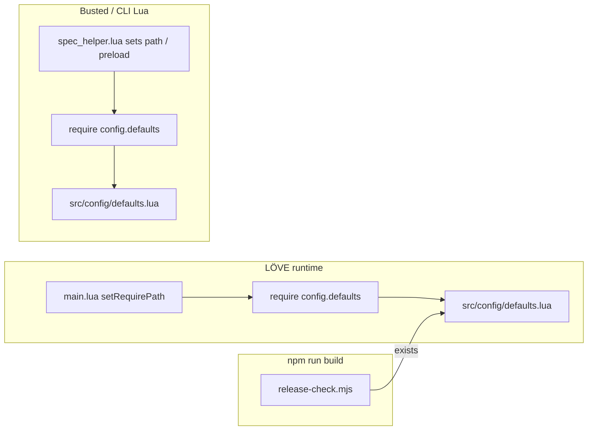

# DESIGN — Fix `config.defaults` module resolution & release integration

**Scope:** This document is the normative blueprint for the Coding Agent task: restore a working runtime and test load path for the **`config.defaults`** Lua module, and align automated checks with the on-disk layout. It builds on the existing LÖVE 11.4 project (`main.lua` → `src/app.lua`, `love.filesystem.setRequirePath` in `main.lua`).

**Requirements:** Satisfy **[REQUIREMENTS.md](./REQUIREMENTS.md)** (R1–R3): identify why the module fails, implement the fix, verify the build/tests.

**Related narrative docs:** Broader game/UX architecture remains in **[CODING_NOTES.md](./CODING_NOTES.md)**, **[README.md](./README.md)**, and **`.pipeline/*.md`** (optional doc sync when paths change).

---

## 1. High-level architecture and approach

### 1.1 Symptom

At runtime under LÖVE, `require("config.defaults")` can fail with a missing-module error even when a Lua file containing the defaults **exists** under `src/`, because the **physical path does not match** how LÖVE resolves dotted module names.

### 1.2 Root cause (normative)

`main.lua` configures the search path:

```2:2:main.lua
love.filesystem.setRequirePath("src/?.lua;src/?/init.lua;" .. love.filesystem.getRequirePath())
```

Per LÖVE’s `require` behavior (see [LÖVE wiki: `require`](https://love2d.org/wiki/require)), **dots in the module name are turned into directory separators** when substituting `?`. Therefore:

| Call | Resolved file (first matching template) |
|------|----------------------------------------|
| `require("config.defaults")` | `src/config/defaults.lua` |
| `require("sim.world")` | `src/sim/world.lua` |

A single file named **`src/config.defaults.lua`** (dot in the **filename**, not a `config/` directory) does **not** satisfy `require("config.defaults")` under those rules. The repo already uses nested layout everywhere else (`sim/world.lua`, `audio/sfx.lua`, etc.); **`config` was the inconsistent outlier**.

### 1.3 Strategy

1. **Relocate** the defaults table module from `src/config.defaults.lua` to **`src/config/defaults.lua`** (new directory `src/config/`).
2. **Keep** every existing `require("config.defaults")` call site **unchanged** (e.g. `src/sim/world.lua`, `src/sim/mole.lua`, `src/ui/hud.lua`, weapons, terrain, render modules — already listed via repo search).
3. **Update** test/bootstrap and release tooling that hard-code the old path string.
4. **Optionally** simplify `spec/spec_helper.lua` after verification: once the path matches both LÖVE and CLI Lua, `package.preload["config.defaults"]` may become redundant; the minimal safe change is to **repointer** the preload `loadfile` path (see §8).

No new third-party dependencies. No change to `package.json` scripts beyond what the Coding Agent needs for verification.

---

## 2. File / directory structure (implementation)

**Add**

- `src/config/defaults.lua` — body moved from current `src/config.defaults.lua` (same `return { ... }` module shape).

**Remove**

- `src/config.defaults.lua` — delete after successful move (avoid duplicate sources of truth).

**Do not add** unless you later introduce more `config.*` modules:

- `src/config/init.lua` — not required for `require("config.defaults")`.

**Unchanged (by default)**

- `main.lua` — require path already correct once the file exists at `src/config/defaults.lua`.
- All gameplay modules that already use `local defaults = require("config.defaults")`.

**Modify**

| File | Reason |
|------|--------|
| `spec/spec_helper.lua` | Repo root detection and `package.preload` / comments reference the old filename. |
| `tools/release-check.mjs` | Include the new path in the required-files list so `npm run build` fails if the module is absent. |
| `TESTING.md`, `ASSETS.md` | Human-facing paths mention `src/config.defaults.lua`; update to `src/config/defaults.lua`. |
| `.pipeline/*.md`, `.pipeline/context-cache.json` | Optional consistency (not required for game to run). |

---

## 3. Data model, interface, schema

The module is a **plain Lua table** returned as the only export (functional core, no OOP).

**Contract:** `require("config.defaults")` returns a table with at least the following **documented fields** (Coding Agent: preserve keys when moving; do not rename unless a follow-up task refactors all consumers):

```lua
-- Pseudocode shape (normative keys; values are numbers/tables as today)
{
  cell = number,
  grid_w = number,
  grid_h = number,
  gravity = number,
  mole_radius = number,
  jump_speed = number,
  walk_speed = number,
  max_dt = number,
  weapon = {
    rocket_speed = number,
    rocket_radius = number,
    rocket_blast = number,
    rocket_damage = number,
    rocket_gravity_mul = number,
    rocket_ray_steps = number,
    grenade_speed_mul = number,
    grenade_fuse = number,
    grenade_blast = number,
    grenade_damage = number,
    grenade_bounce = number,
    grenade_unstick_px = number,
  },
  wind_force = { low = number, med = number, high = number },
  colors = {
    team1 = { r, g, b },
    team2 = { r, g, b },
    sky_top = { r, g, b },
    sky_bot = { r, g, b },
    dirt = { r, g, b },
    dirt_dark = { r, g, b },
    grass = { r, g, b },
  },
}
```

**Consumers (reference only — no require string changes):** `src/sim/world.lua`, `mole.lua`, `physics.lua`, `terrain.lua`, `terrain_gen.lua`, `src/sim/weapons/rocket.lua`, `grenade.lua`, `src/render/mole_draw.lua`, `terrain_draw.lua`, `src/ui/hud.lua`.

---

## 4. Component breakdown

| Area | Responsibility |
|------|----------------|
| **`src/config/defaults.lua`** | Single source of truth for global tuning (grid, physics, weapons, wind magnitudes, palette). |
| **`main.lua`** | Already prefixes `src/?.lua`; no code change expected after file move. |
| **Sim / render / HUD** | Continue to `require("config.defaults")` and read fields; no architectural change. |
| **`spec/spec_helper.lua`** | Ensures busted/CLI runs find `src/` and, until proven otherwise, can keep an explicit `loadfile` for `config.defaults` keyed to the **new** path. |
| **`tools/release-check.mjs`** | Treat `src/config/defaults.lua` as a **ship gate** artifact alongside `main.lua`, `src/app.lua`, etc. |

---

## 5. Dependencies and technology choices

- **LÖVE 11.4** (see `conf.lua`) — existing; no version change.
- **Node.js** — existing; `npm run build` remains a file-presence gate (`tools/release-check.mjs`).
- **Busted** — optional on developer machines; behavior defined in `TESTING.md` / `spec/spec_helper.lua`.

**Rationale:** Fixing the path aligns with LÖVE’s documented `require` semantics and matches the rest of the tree (`sim.*`, `audio.*`, `util.*`), eliminating reliance on a misleading flat filename.

---

## 6. Implementation notes for the Coding Agent

### 6.1 Required steps (checklist)

1. Create `src/config/` if missing.
2. Move **`src/config.defaults.lua`** → **`src/config/defaults.lua`** (git-friendly: `git mv` if using git).
3. Delete the old `src/config.defaults.lua` if anything remains.
4. Update **`spec/spec_helper.lua`**:
   - Every probe path and comment that mentions `src/config.defaults.lua` → **`src/config/defaults.lua`**.
   - Set `config_defaults_path` (or equivalent) to the new location.
   - Fix the misleading comment: LÖVE maps `config.defaults` → **`config/defaults.lua`**, not `config.defaults.lua`.
5. Update **`tools/release-check.mjs`**: append `"src/config/defaults.lua"` to the `required` array.
6. Update **`TESTING.md`** and **`ASSETS.md`** path strings so future agents don’t recreate the wrong file name.
7. **Verify** (R3): `npm run build`; run `love .` from repo root and reach gameplay load (or at least past first `require("config.defaults")`); run `busted` if installed.

### 6.2 Optional cleanup (after tests pass)

- If `require("config.defaults")` resolves without `package.preload` when only `package.path` is prefixed with `src/?.lua`, consider **removing** `package.preload["config.defaults"]` from `spec_helper.lua` to reduce duplication. **Do not** remove it in the same commit as the move unless busted is run and green.

### 6.3 Anti-patterns (do not do)

- Do **not** rename the module to `require("config_defaults")` unless you are prepared to touch every call site for no benefit.
- Do **not** keep two copies of the defaults table in different files.
- Do **not** add implementation files other than the moved module and the listed edits (per task scope).

### 6.4 Doc-only follow-ups

Search for `config.defaults.lua` in **`.pipeline/`** and refresh to `src/config/defaults.lua` when convenient; this does not block the game build.

---

## 7. Verification flow (mermaid)



---

## 8. Success criteria

- `require("config.defaults")` succeeds under LÖVE with **only** `src/config/defaults.lua` present (no `src/config.defaults.lua`).
- `npm run build` passes and **fails** if `src/config/defaults.lua` is deleted.
- Spec helper resolves repo root using the new sentinel path; busted specs that load sim modules still run when busted is available.

---

## 9. Requirements traceability

| ID | Requirement | Design coverage |
|----|-------------|-----------------|
| R1 | Identify missing `config.defaults` in the build | §1.2 root cause (path vs. LÖVE `require` rules) |
| R2 | Implement changes to include `config.defaults` | §1.3 strategy, §2 structure, §6.1 checklist |
| R3 | Test build after fix | §6.1 step 7, §8 success criteria |
