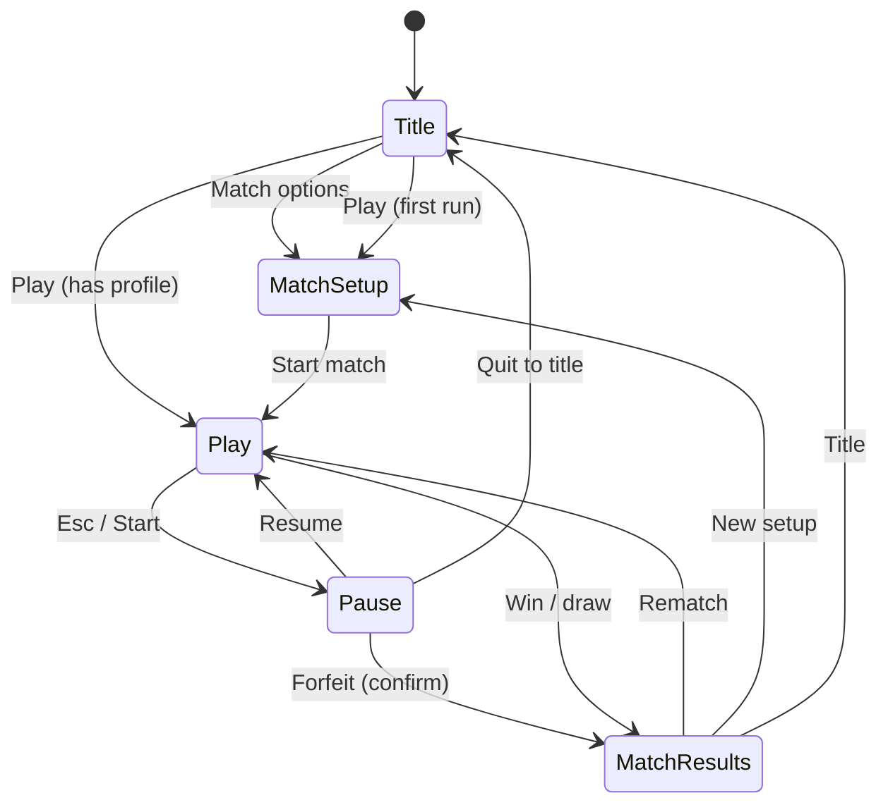

## Original task (source of truth)

Create a beautifully styled 'moles' clone of the game 'worms' that implements the core game mechanics, including rocket launchers and grenades. The game should support 2 player local mode with procedurally generated maps, keep track of scores of games played since launching, and allow teams of 5 moles per player, rotating players and moles each round. Include options for players to set match variables like mole health and support for 2 players on a single keyboard/mouse or with separate controllers.

---


## Requirements traceability

Numbered requirements extracted from the user task: **[REQUIREMENTS.md](./REQUIREMENTS.md)**. Implementation must satisfy each item or document deferral in **CODING_NOTES.md**.

<!-- requirements-traceability-linked -->

---


## Original task (source of truth)

Create a beautifully styled 'moles' clone of the game 'worms' that implements the core game mechanics, including rocket launchers and grenades. The game should support 2 player local mode with procedurally generated maps, keep track of scores of games played since launching, and allow teams of 5 moles per player, rotating players and moles each round. Include options for players to set match variables like mole health and support for 2 players on a single keyboard/mouse or with separate controllers.

---

## Requirements traceability

See **[REQUIREMENTS.md](./REQUIREMENTS.md)** (R1–R11). Implement each or document deferral in **CODING_NOTES.md**.

---

## Merged document structure

This file concatenates **.pipeline/game-designer-design.md**, **.pipeline/love-ux-design.md**, and **.pipeline/love-architect-design.md** with the Original task above. **Normative turn rotation** is the Game Designer **Turn model** pseudocode (Part A). If sections disagree, Game Designer turn rules win.

---

# Part A — Game Designer
# Game Designer — Moles (Worms-like) Design

**Audience:** merge into `DESIGN.md` + Coding Agent blueprint  
**Framework:** LÖVE **11.4**  
**Repo baseline:** `REQUIREMENTS.md` (R1–R11); entry via `main.lua` → `app`; data `src/data/match_settings.lua`, `src/data/session_scores.lua` (R6); sim layer `src/sim/turn_state.lua`, `terrain.lua`, `terrain_gen.lua`, `physics.lua`, `damage.lua`; tuning `src/config.defaults.lua`. Full merged spec: root `DESIGN.md`.

---

## requirementsChecklist

Traceability: one bullet per distinct requirement from the user task and BigBoss brief. Coder ticks when implemented.

- [ ] **R-presentation**: Game is a **beautifully styled** presentation of a Worms-like experience (visual identity, readable entities, cohesive art direction — execution by art/UX; mechanics support clarity).
- [ ] **R-clone-scope**: Delivers a **“moles” clone** of **Worms** in spirit: side-view, destructible terrain, indirect weapon fire, turns, elimination win.
- [ ] **R-core-mechanics**: **Core Worms-style mechanics** present: terrain, gravity, movement/jumps, aiming, firing, damage, knockback, elimination, turn flow.
- [ ] **R-rocket**: **Rocket launcher** is a selectable weapon with distinct behavior (fast projectile, impact explosion, terrain destruction).
- [ ] **R-grenade**: **Grenade** is a selectable weapon with distinct behavior (arc trajectory, timed fuse, bounce optional, explosion + terrain destruction).
- [ ] **R-2p-local**: **Two-player local** multiplayer (same machine, hotseat or split attention as per input mode).
- [ ] **R-proc-maps**: **Procedurally generated maps** for each match (or per session rule — default: new terrain each new game), reproducible via seed for debugging/fairness.
- [ ] **R-session-score**: **Scores for games played since app launch** tracked (session-only persistence per REQUIREMENTS; reset on quit).
- [ ] **R-team-size**: Each human controls a **team of 5 moles**.
- [ ] **R-rotate-turns**: **Players alternate turns** each “turn” (standard Worms cadence: one team acts, then the other).
- [ ] **R-rotate-moles**: **Moles rotate** as the active character: when a player’s turn comes around again, control advances to the **next living mole** in a fixed team order (dead moles skipped).
- [ ] **R-match-vars**: **Match options** exposed before play (at minimum **mole max health / starting health**; room for more toggles without contradicting scope).
- [ ] **R-input-shared-kbm**: **Two players on one keyboard + mouse**: viable control scheme with clear ownership of input per active turn.
- [ ] **R-input-dual-pad**: **Two players with separate controllers** (gamepads): each player mapped to their own device where possible.
- [ ] **R-bigboss-teams**: Design supports **team dynamics**: two sides, friendly-fire policy, win when opposing team has no living moles, clarity of “which side am I on.”
- [ ] **R-bigboss-rotation**: Explicit **player + mole rotation** model documented and implemented (see **Turn model** below).

---

## targetLoveVersion

`11.4` — match wiki/API stability used across the pipeline.

---

## mechanics

### High-level pitch

**Moles** is a **2D side-view**, **turn-based** artillery/tactics game. Two human players each command **5 moles** on **destructible procedural terrain**. On a turn, the active player moves and fires **one weapon** (from a small loadout including **rocket launcher** and **grenade**). The match ends when one side has **no living moles**. **Session score** records how many **match wins** each player (or each team slot) has earned **since the executable started**.

### Camera / world

- **Side view** (Worms-like): gravity pulls downward; terrain is a bitmap or polygon mask treated as solid for collisions.
- **Scale**: moles readable at target resolution (~32–48 px tall baseline suggestion for art; coder scales consistently).

### Turn model (players + moles rotation)

**Normative rule:** The **`on_end_turn` / `advance_mole_index` pseudocode block below is authoritative** for turn and mole rotation. Any prose in other pipeline docs (e.g. LÖVE Architect) that implies advancing the **opponent’s** roster when a turn ends, or advancing a roster when a turn **starts**, is **out of date** — implement the pseudocode. **Where merged architecture prose (e.g. `DESIGN.md`, LÖVE Architect) disagrees with this Turn Model, this pseudocode overrides it for player/mole rotation; align `src/sim/turn_state.lua` (and callers) to the pseudocode, not the conflicting paragraph.**

**Product intent — symmetric same-slot progression:** Each human alternates as **turn owner**. Each player’s **roster slot index** (1..5) advances **only when that player ends their own turn**, so after a full **player–player cycle** (P1 acts, then P2 acts), **both** teams have stepped forward one **living** mole in lockstep when no asymmetrical deaths have occurred — i.e. both sides stay on the **same slot number** relative to their rosters (both on “slot 2” for their next respective turns, etc.). Deaths desync indices by skipping dead moles per `advance_mole_index`.

1. **Turn owner**: Exactly one **human player** is active at a time (`PlayerId` 1 or 2).
2. **Active mole**: The active player controls **one mole** for the entire turn — the **current index** in that player’s roster (1..5).
3. **End of turn**: Triggered explicitly by player (**“End turn”** action) or optionally by **timeout** if match options include turn timer (recommended as optional match var, default off for first implementation).
4. **Handoff to opponent**: When the active player ends their turn, **only the ended player’s** roster pointer is advanced (see pseudocode); the opponent’s `mole_index` **does not change** at that moment. Turn ownership passes to the other player.
5. **Skipping dead moles**: `advance_mole_index` walks the ring 1..5 until a **living** mole is selected or the team is eliminated (win check should run before offering a turn to a dead team).
6. **First turn of match**: Menu or random determines **who goes first**; each team’s `mole_index` starts at **first living mole** (typically slot 1). **Do not** call `advance_mole_index` before the first turn’s gameplay begins.

*Pseudocode (normative — design intent, not drop-in code):*

```
on_match_start():
  turn_player = option_or_random(P1, P2)
  for each player p: mole_index[p] = first_living_mole(p)  # typically 1

on_end_turn(ended_player):
  advance_mole_index(ended_player)   # roster pointer moves for NEXT time this player acts
  turn_player = other(ended_player)

advance_mole_index(p):
  repeat
    mole_index[p] = next_index_in_ring(mole_index[p], 1..5)
  until mole[p][mole_index[p]] is alive OR no living moles remain for p
```

**Clarification for Coding Agent:** Advance **only** the **player who ended the turn**; switching `turn_player` does **not** by itself advance anyone’s roster. This yields **symmetric same-slot** pacing versus classic “only one team’s worm advances per global step” rulesets — it matches **R8** (“rotating players and moles each round”) as written for this product.

### Movement & aiming

- **Movement**: Walk left/right on terrain surface; **jump** with limited air control (Worms-like). No infinite jetpack unless added later.
- **Player rotation (facing)**: Each mole has **facing** `left` | `right`. Walking updates facing. **Aiming** is a separate **aim angle** (e.g. radians or degrees) relative to facing or world-up — recommend **world-space aim cone** (e.g. −150° to −30° from horizontal) so rocket/grenade arcs read clearly. **Rotate aim** with dedicated inputs (keyboard or stick); mouse, when allowed, sets aim direction from mole to cursor.
- **Weapon inventory**: Minimal for V1: **Rocket**, **Grenade**, **maybe Skip / utility later**. Player cycles weapon with a **weapon next/prev** action (or fixed slots).

### Weapons (behavioral spec)

| Weapon        | Trajectory | Detonation | Terrain | Damage radius | Notes |
|---------------|------------|------------|---------|---------------|-------|
| Rocket launcher | Straight or mild gravity-affected raycast/segment motion | On impact with terrain or mole | Strong carve | Medium | Fast, thin **silhouette**; optional short **trail** for readability |
| Grenade       | Parabolic under gravity | **Fuse timer** (e.g. 3–5 s) or **impact** (choose one default: **timer** is classic); optional low bounce | Medium carve | Medium-large | Round **silhouette**; **blinking fuse** or color pulse for telegraph |

- **Knockback**: Explosions apply impulse; moles can fall or get **dunked** in water/death plane if implemented (optional V1: instant death below map).
- **Friendly fire**: **Match option** — default **OFF** for accessibility; when ON, own team can be damaged.

### Win / lose

- **Elimination**: When a player has **zero living moles**, the other player **wins the match**.
- **Draw**: Rare (simultaneous last kill) — resolve with **tie** or **sudden death** round (design: **tie** increments neither score unless UX prefers replay).

### Session scoring (since launch)

- On match end: increment **`wins[player]`** for winner.
- **Displayed** between matches and on a **session stats** area (exact HUD layout → UX agent).
- **Not** required to persist across quit (per R6 wording).

### Match variables (minimum set)

| Variable | Type | Notes |
|----------|------|-------|
| `mole_health` | int | Starting / max HP for all moles in match |
| `first_player` | P1 / P2 / random | Who takes first turn |
| `friendly_fire` | bool | Default false |
| `turn_time_limit` | float or off | Optional |
| `map_seed` | int | Optional override for proc gen |

Additional vars (nice-to-have, not required by R1–R11): wind, explosion radius scale, jump power.

### Team dynamics

- **Teams**: Player 1 = **Team A** (palette 1), Player 2 = **Team B** (palette 2). Moles spawn on **opposite halves** or **scattered** with clear team color **hats/vests/scarves** (art).
- **No AI teammates** in scope: exactly two humans, five moles each.

---

## controls

### Actions (semantic)

| Action | Purpose |
|--------|---------|
| Move left / right | Walk |
| Jump | Leave ground |
| Aim adjust + / − | Rotate launcher angle |
| Power + / − (optional) | If using charge mechanic; else fixed power |
| Fire | Launch rocket / throw grenade |
| Weapon next / prev | Select rocket vs grenade |
| End turn | Commit turn |
| Pause | Global (if UX implements) |

**Mouse (when active for current player):** aim toward cursor; **LMB** fire; **scroll** optional for weapon cycle.

### Two players — **one keyboard + mouse**

**Policy:** Only the **turn owner** receives **mouse** aim. The other player’s inputs are ignored for gameplay (except pause if shared).

**Suggested layout (rebindable later):**

| Action | Player 1 | Player 2 |
|--------|----------|----------|
| Move | `A` / `D` | Left / Right arrows |
| Jump | `W` or `Space` | `Up` or `RShift` (or `Enter` as jump if UX prefers) |
| Aim − / + | `Q` / `E` | `[` / `]` or `,` / `.` |
| Fire | `F` or `LMB` when P1 turn | `;` or `LMB` when P2 turn |
| Weapon cycle | `1` / `2` or `Tab` | `-` / `=` |
| End turn | `G` | `Backspace` or `\` |

*Coding Agent:* centralize **input routing** by `turn_player` + **device policy** so key conflicts are minimized.

### Two players — **separate gamepads**

- **Player 1** → first detected joystick or assignment from menu; **Player 2** → second.
- **Suggested:** Left stick or D-pad move; `A`/`X` jump; right stick **aim** (preferred) or bumpers for aim; `RT` fire; `LB`/`RB` weapon; `Y` end turn.
- **Hotseat rule:** Ignore non-active pad except **pause** if both can pause — UX decision.

### LÖVE callback mapping (where logic lives conceptually)

- `love.keypressed` / `love.keyreleased` → buffer digital state.
- `love.mousemoved` / `love.mousepressed` → only if `mouse_owner == turn_player` and match uses mouse aim.
- `love.joystickpressed` / axis polling in `love.update` → per-player slots.
- **Single module** conceptually responsible for **InputRouter(player, turn, scheme)** — actual file path is Architect’s call.

---

## gameLoop

### States (state machine)

1. **Boot / splash** (optional)
2. **Main menu** — new match, match options, input test, quit
3. **Match setup** — confirm seed, health, devices
4. **Playing** — turn-based combat
5. **Round interstitial** (optional) — only if multi-round match; REQ implies **match = one terrain + fight**; session is multiple matches
6. **Match over** — show winner, update session score, rematch or menu
7. **Pause** (overlay on Playing)

### Update / draw flow (per frame)

```
update(dt):
  if pause: handle pause-only input; return
  if state == Playing:
    if projectiles_active: integrate physics, collisions, explosions, damage
    elif turn_phase == moving: apply mover input to active mole
    elif turn_phase == aiming: apply aim input; maybe charge timer
    check win condition

draw():
  draw terrain → moles → projectiles → particles → UI (UX owns layout)
```

**Turn phases (recommended):** `moving` → `aiming` → `firing` → `watching` (projectiles/explosions resolve) → auto-return to `moving` or prompt **End turn**. Simpler V1: single phase **combined** move+aim until Fire or End turn — still document projectile resolution as **watching**.

---

## fileStructure

*Game-designer hints only — Architect owns full tree.*

| Area | Suggested responsibility |
|------|---------------------------|
| `main.lua` | Bootstrap, require scenes, delegate `love.*` |
| `conf.lua` | Window, vsync |
| Scene modules (e.g. `src/scenes/*.lua`) | Menu, play, gameover |
| World/combat modules | Terrain, mole entities, projectiles, explosions, turn controller |
| `src/data/` or inline | Weapon defs (damage, radius, fuse, sprite ids) |
| Input | Dedicated router used by play scene |

**Dependency direction:** scenes orchestrate; entities do not require scenes; weapons data tables do not require entities.

---

## considerations

- **Determinism:** Proc gen + session score + turn order should use explicit seeds where useful for **replays / QA**.
- **Controller detection:** On menu, show **which device** is assigned to P1/P2; allow **reassign**.
- **Keyboard conflict:** Shared-keyboard layout must avoid **same key** for both players’ primary actions.
- **Performance:** Destructible terrain updates are costly — Architect may choose mask + batch redraw; designer constraint: **explosion count** per turn bounded by weapon types.
- **Readability:** Rockets vs grenades must differ by **shape, color, motion, and audio** (see below).

---

## scenesOrScreens

| Scene | Entry | Exit |
|-------|-------|------|
| Main menu | Boot | Start match → setup; Quit |
| Match setup | Menu | Play |
| Play | Setup / rematch | Match over when win; Pause |
| Pause | Play | Resume Play or Menu |
| Match over | Play | Rematch (new proc map) or Menu |

---

## assetStructure

*Naming for game-art handoff — paths illustrative.*

```
assets/
  sprites/
    mole_team_a_idle.png / mole_team_a_walk_*.png / mole_team_a_aim.png
    mole_team_b_*.png
    rocket.png
    grenade.png
    terrain_tileset.png (if tile-based) OR generated at runtime (coder)
  audio/
    sfx_rocket_fire.wav
    sfx_grenade_toss.wav
    sfx_explosion_*.wav
    ui_click.wav
  fonts/
    (UI font — UX picks)
```

**Animation states (minimum):** idle, walk (2+ frames or bob), aim/fire pose, hurt, death (simple fall off or poof).

---

## persistence

- **Session score (R6):** Match wins since app launch — implement via existing module **`src/data/session_scores.lua`** (or successor API); **no disk persistence** required for R6.
- **Match options:** Tune from **`src/data/match_settings.lua`** / setup UI; align field names with `MatchRules` / architect tables.
- **Optional later:** `love.filesystem` for settings (volume, key binds) — **out of scope** for R6 unless UX expands.

---

## implementationOrder

1. **Core loop + terrain + one mole** movement/jump on static test map.
2. **Second mole + turn switching** (no weapons) to validate rotation pointers.
3. **Rocket** + collisions + terrain destruction + damage.
4. **Grenade** + fuse + distinct VFX.
5. **5 moles per team**, spawn placement, elimination win, **session score**.
6. **Proc gen** maps hooked to match start + seed option.
7. **Match options** (health, friendly fire, first player).
8. **Input modes**: shared KB+M routing + two gamepads.
9. **Polish**: particles, screenshake (subtle), sound; menu flow to UX spec.

---

## Visual gameplay (in-world)

- **Silhouette & scale:** Moles **chunky**, **team-colored accessory** visible at all times; weapons **readable** when equipped (small launcher on back or in hands).
- **Projectiles:** Rocket = **elongated**, fast, **orange/red trail**; Grenade = **round**, **arc**, **pulsing fuse** pixel or timer ring.
- **Animation hooks:** States listed under **assetStructure** drive which sprite set is shown.

---

## Notes for Coding Agent

- Treat `REQUIREMENTS.md` R1–R11 as **acceptance criteria**; this doc refines **behavior** only.
- **Turn/mole rotation:** Follow the **normative pseudocode** in **Turn model**; **symmetric same-slot** progression is intentional. **`turn_state.lua`** (or equivalent) must not advance the inactive player’s roster on turn end.
- **Player rotation** = strict **alternating turns** between humans; **mole rotation** = **that player’s** roster index advances **once per their own completed turn** (skip dead).
- **Mouse** in shared mode: **gate** all mouse handlers on `active_player == mouse_bound_player` or “only active turn.”
- Keep weapon parameters in **data tables** so tuning does not scatter magic numbers.
- Do not implement **network multiplayer** in this design scope.

---

*End of game-designer design document.*

---

# Part B — LÖVE UX
# LÖVE UX Design — Moles (Worms-style clone)

**Agent:** `love-ux`  
**Scope:** Screens, HUD, input affordances, resolution/scaling, focus/navigation — not combat math or physics (Game Designer / LÖVE Architect).  
**Traceability:** Maps to `REQUIREMENTS.md` R1–R11 and the checklist in root **`DESIGN.md`**.

**Orchestrator / merge note:** Sections **§2–§8** (resolution through components), **§11** (JSON), and **§12** (crosswalk) are intended to be copied into root **`DESIGN.md`** as a self-contained chapter (suggested heading: **`## LÖVE UX — Screens, HUD, flows, and input`**). §0–§1 and §9–§10 remain implementation handoff; include them in the merge if the merged doc should be fully self-contained for coders. **This file is the canonical source** — do not truncate wireframes, §4 flows, §5–§6 input/accessibility, or the component list when merging.

---

## 0. Codebase baseline (build on these files)

| File | UX relevance |
|------|----------------|
| **`conf.lua`** | Window **1280×720**, **min** **960×540**, resizable, vsync, identity `moles-wormslike`, title `Moles`, **LÖVE 11.4** — design anchors in §2 match this exactly. |
| **`main.lua`** | Thin callbacks; delegates to **`src/app.lua`** when present (Coding Agent). UI scenes: architect’s `src/scenes/` + `src/ui/`. |
| **`src/data/match_settings.lua`** | **Authoritative schema** for match-setup: `defaults()`, `validate()`, `merge_partial()`. UI commits only through this module. |
| **`src/data/session_scores.lua`** | Session wins/draws: `get_snapshot()`, `record_match_outcome(winner_id)`, `reset()`. |
| **`src/config.defaults.lua`** | Tuning + **`colors.team1` / `colors.team2`**, **`weapon.grenade_fuse`**, **`wind_force.low|med|high`** — HUD copy for wind/fuse can reference these for consistency (display labels, not raw numbers required). |
| **`src/sim/turn_state.lua`** | **Turn truth** for HUD: `active_player` (1\|2), `mole_slot[1]`, `mole_slot[2]`, `turn_time_left` / `_turn_limit`, `end_turn`, `update_timer`. **TurnView** (§1.3) must reflect this state after `sync_slots_to_living`. |
| **`src/sim/terrain_gen.lua`** | Procedural map (R5); surface **`map_seed`** from `match_settings` in **`MapMetaView`** when set. |
| **`src/sim/terrain.lua`**, **`damage.lua`**, **`physics.lua`** | In-world readability (hits, knockback, destruction) should emit **events** the HUD/effects layer can show (numbers optional; flash/shake per §6). |

**Pseudocode — UI ↔ data modules:**

```lua
local match_settings = require("data.match_settings")
local s = match_settings.merge_partial(last_settings, form_partial)

local session_scores = require("data.session_scores")
local snap = session_scores.get_snapshot()

session_scores.record_match_outcome(winner_id) -- 1, 2, or 0 draw
```

**Team colors (HUD):** `local defaults = require("config.defaults")` then `defaults.colors.team1`, `defaults.colors.team2`.

---

## 1. High-level architecture (UX layer)

### 1.1 Design intent

- **Readable in motion:** HUD and world feedback stay legible during camera pan, explosions, and turn transitions (R1).
- **Two local humans, zero ambiguity:** Always show *whose turn it is*, *which mole slot is active*, and *which input mode* applies (R4, R10, R11).
- **Match variables before play:** All **`match_settings`** fields editable in setup (R9).
- **Session score:** **`session_scores.get_snapshot()`** on title, HUD, results (R6).

### 1.2 Scene graph — UX ids ↔ architect scenes

| UX id | Architect scene | Lua hint |
|-------|-------------------|----------|
| `scene_title` | MainMenu | `src/scenes/menu.lua` |
| `scene_match_setup` | MatchSetup | `src/scenes/match_setup.lua` |
| `scene_gameplay` | Play | `src/scenes/play.lua` |
| `overlay_pause` | Pause | `src/scenes/pause.lua` |
| `scene_round_summary` | RoundEnd (optional) | `src/scenes/round_end.lua` |
| `scene_match_results` | MatchEnd | `src/scenes/match_end.lua` |

### 1.3 View model contract

**`SessionView`** — `session_scores.get_snapshot()`:

```text
gamesPlayedP1, gamesPlayedP2, gamesDrawn, games_played
```

**`MatchSettingsView`** — after `match_settings.validate()`:

```text
moles_per_team (fixed 5), mole_max_hp, first_player, friendly_fire,
turn_time_seconds, map_seed, input_mode ("shared_kb"|"dual_gamepad"), wind
```

**`TurnView`** — align with **`src/sim/turn_state.lua`**:

```text
active_player          -- 1 | 2
active_mole_slot       -- mole_slot[active_player], 1..5
inactive_mole_slots    -- optional: show opponent’s slot for context
turn_time_left         -- number; hide or show “∞” when turn_time_seconds == 0
phase                  -- move | aim | firing | resolving (labels for UX only; sim may collapse)
```

**`CombatHudView`:** `weapon: rocket|grenade`, `aim_angle`, `power_01`, `grenade_time_left` (live fuse) / `grenade_fuse_total` (from defaults for bar max).

**`RosterView`:** per player, slots 1..5: `hp_current`, `hp_max`, `alive`, optional `name`.

**`MapMetaView`:** `seed` if non-random; short label “Procedural map” if nil.

---

## 2. Resolution, scaling, and safe areas

### 2.1 Base logical resolution

- **`conf.lua`:** **1280 × 720**. All regions in §3 use this space.

### 2.2 Minimum window

- **960 × 540** — keep critical controls inside **safe margins** so nothing clips.

### 2.3 Safe margins

- **≥ 24 px** from edges for interactive HUD and primary copy.
- **≥ 48 px** for elements that must not clip under letterboxing on non-16:9 displays.

### 2.4 Scaling

- Uniform scale to logical 720p; letterbox/pillarbox as needed.
- Prefer crisp UI (canvas at logical size, scaled draw). **No illegible micro-text** on large monitors.

---

## 3. Wireframes — pixel regions (1280 × 720)

### 3.1 `scene_title` (MainMenu)

| Region (x, y, w, h) | Element |
|---------------------|---------|
| (0, 0, 1280, 720) | Full-bleed background, vignette |
| (440, 180, 400, 280) | Card: logo / wordmark **Moles** |
| (440, 420, 400, 140) | Vertical stack, **56 px** row height, **12 px** gap: **Play**, **Match options**, **How to play**, **Quit** |
| (40, 40, 520, 120) | **Session chip:** `P1 wins · P2 wins · Draws` + caption *This session* |
| (840, 600, 400, 80) | Version / credits (low contrast) |

**Element inventory:** background art layer; title card; four primary buttons; session stats block; footer line.

**Focus order:** Play → Match options → How to play → Quit. **Default:** Play.

**Play:** If no saved setup profile, **force** Match setup; else start with last validated **`match_settings`** and bindings.

---

### 3.2 `scene_match_setup` (MatchSetup)

| Region | Element |
|--------|---------|
| (40, 32, 1200, 64) | Header *Match setup*; breadcrumb `Title â–¸ Setup` |
| (40, 112, 580, 520) | **Player 1** column — accent `team1` color |
| (660, 112, 580, 520) | **Player 2** column — accent `team2` color |
| (40, 656, 1200, 48) | Footer: **Back** (left), **Start match** (right, primary) |

**Per column**

1. **Input / mode copy** (see `input_mode`): `shared_kb` explains shared KB+M; `dual_gamepad` shows **Assigned: Gamepad A/B** or *Unassigned* + warning.
2. **Five mole pips** (slots 1–5), read-only preview.

**Match variables** (bind 1:1 to **`match_settings`**):

| Field | Control | Label |
|-------|---------|--------|
| `moles_per_team` | Read-only | “5 moles per team” |
| `mole_max_hp` | Stepper / chips | “Mole health” (10–500) |
| `first_player` | Segmented | “Who goes first?” P1 / P2 / Random |
| `friendly_fire` | Toggle | “Friendly fire” |
| `turn_time_seconds` | 0 + presets + numeric | “Turn limit” (0 = off, max 300) |
| `map_seed` | Text / empty | “Map seed (optional)” |
| `input_mode` | Two cards | “Shared keyboard & mouse” vs “Two gamepads” |
| `wind` | Segmented | Off / Low / Med / High |

**Focus model:** P1 column top→bottom → P2 column → globals (match variables) → footer. Optional **LB/RB** to jump P1↔P2 headers. **Default focus:** first control in P1 column (or `input_mode` if listed first in implementation).

---

### 3.3 `scene_gameplay` (Play) — HUD

| Region | Content |
|--------|---------|
| (24, 16, 600, 88) | **Turn banner:** `Player {n} — Mole {slot}` + team dot (colors from `config.defaults`) |
| (656, 16, 600, 88) | **Session line:** `P1 W · P2 W · D` |
| (24, 104, 340, 200) | **Weapon & aim:** icons rocket/grenade, angle, power bar; grenade **fuse** bar + seconds |
| (916, 104, 340, 200) | **Wind** (if not off): arrow + Low/Med/High; **turn countdown** if timer on |
| (24, 620, 1232, 76) | **Roster bar:** two groups × 5; HP per slot; dead = dim/grey |

**Element inventory:** turn + session; weapon panel; wind/timer; full roster; world-layer trajectory (rocket dashed line); grenade arc optional; active-mole **ring** in world + **2 px** roster highlight.

**Weapon UX:** selected = filled icon; other = outline. **Rocket:** high-contrast dashed trajectory + small impact marker. **Grenade:** visible **fuse pulse** (color or blink) matching danger.

---

### 3.4 `overlay_pause` (Pause)

- Dim world **~40%**.
- Modal **520 × 360** centered (e.g. x=380, y=180):

| Row | Control |
|-----|---------|
| 1 | **Resume** (default focus) |
| 2 | **How to play** |
| 3 | **Forfeit match** (destructive, secondary style) |
| 4 | **Quit to title** |

**Open:** Esc, Start (gamepad). **Close from Resume:** Esc, B/back.

---

### 3.5 `scene_match_results` (MatchEnd)

| Region | Content |
|--------|---------|
| (240, 80, 800, 120) | Headline: winner or Draw |
| (240, 220, 800, 280) | Stats: turns, survivors, duration (optional) |
| (240, 520, 800, 120) | **Rematch** · **New setup** · **Title** |

Ensure **`session_scores.record_match_outcome`** has run before or when this screen is shown; displayed totals must match **`get_snapshot()`** (R6).

---

### 3.6 `scene_round_summary` (optional)

Toast or full-screen **1.2–2 s:** e.g. *Next: Player 2 — Mole 3* for rotation clarity (R8).

---

## 4. User flows (step-by-step)

### 4.1 Cold start → first match

1. Launch → **`scene_title`** (session 0-0-0).
2. **Match options** → **`scene_match_setup`** → edit → **`match_settings.merge_partial`** → **Start match** → short load (“Digging tunnel…”) → **`scene_gameplay`**.
3. **Play** on title: last settings, or setup if none / first run.

### 4.2 In-match loop

1. Turn start → banner + roster highlight + camera on active mole (`turn_state.active_player`, `mole_slot`).
2. Move/aim → weapon panel + trajectory/fuse update.
3. Fire → **resolving** feedback; brief input lock.
4. Damage → HP bar animation; optional edge flash (team color).
5. End turn (player or timer) → sim calls **`end_turn`** → optional **`scene_round_summary`**.
6. Repeat until win condition.

### 4.3 Turn timer (when `turn_time_seconds` > 0)

- HUD shows **`turn_time_left`**.
- At 0, auto **end turn** (same UX as manual end: brief toast *Time’s up*).

### 4.4 Match end

1. Win/draw detected → short celebration (**≤ 2 s**) → **`scene_match_results`**.
2. Session chip on next **`scene_title`** reflects new totals.

### 4.5 Pause

**Gameplay** → Esc/Start → **`overlay_pause`** → Resume (return) | How to play | Forfeit | Quit to title.

### 4.6 Forfeit

**Forfeit match** → confirm dialog (recommended) → declare opponent winner → **`scene_match_results`** or compact **forfeit results** line → **`record_match_outcome`**.

### 4.7 Rematch / setup / title

- **Rematch:** same **`match_settings`**, new terrain (unless seed fixed), new **`turn_state`**, → **`scene_gameplay`**.
- **New setup:** → **`scene_match_setup`**.
- **Title:** → **`scene_title`**.

### 4.8 Dual gamepad gaps

If **`dual_gamepad`** and <2 pads: **warning**, offer switch to **`shared_kb`** or wait; never silent failure.

### 4.9 State diagram (high level)



---

## 5. Input mappings and interactions

### 5.1 `match_settings.input_mode`

| Value | Behavior |
|-------|----------|
| `shared_kb` | One keyboard + mouse; **mouse aim only for `turn_state.active_player`** (R10). |
| `dual_gamepad` | Two controllers; map joysticks to P1/P2 (R11). |

Show summaries on setup + **How to play**.

### 5.2 Shared keyboard + mouse

| Action | P1 | P2 |
|--------|----|----|
| Aim (mouse) | when active | when active |
| Aim left/right | A / D | Left / Right |
| Power up/down | W / S | Up / Down |
| Fire | Space | Right Ctrl or Enter (pick one) |
| Jump | Q | ] or Numpad 0 |
| Weapon | 1 / 2 or [ / ] | , / . |
| End turn (optional) | E | Numpad Enter |
| Pause | Esc | Esc |

**Tooltip (first session):** *Mouse aims the active player only.*

### 5.3 Gamepad (each player)

| Action | Map |
|--------|-----|
| Aim | Left stick |
| Fine aim | D-pad L/R |
| Power | Triggers (preferred) or R-stick vertical |
| Fire | South face |
| Weapon | LB / RB |
| End turn | Y / Triangle (optional) |
| Pause | Start |

**How to play:** ~**15%** dead zone note.

### 5.4 Global

Quit from title; **Quit to title** from pause.

### 5.5 Menu / setup navigation (controller)

- **A / cross:** activate.
- **B / circle:** back (setup footer **Back**, pause dismiss when on Resume).
- **D-pad / stick:** move focus.
- **Default focus** per screen as in §3.

---

## 6. Accessibility & readability

- **Contrast:** UI text **≥ 4.5:1** on panels; stroked or chip-backed turn text.
- **P1/P2:** always **text labels**; color is secondary (left/right or icon shape).
- **Type scale (logical px):** body **18–20**, HUD numbers **≥ 22**, title **≥ 36**.
- **Reduce motion** (optional future toggle): shorten toasts, disable camera shake.
- **In-world:** mole + projectile **silhouette/outline**; explosion **1–2** bright frames; damage **optional floating numbers** (off by default if busy).

---

## 7. File / directory structure (UX-facing)

**Present in repo:** `conf.lua`, `main.lua`, `src/config.defaults.lua`, `src/data/match_settings.lua`, `src/data/session_scores.lua`, `src/sim/*`, `src/util/*`.

**Typical additions (architect-aligned):**

```text
assets/fonts/
assets/ui/
src/app.lua
src/scenes/menu.lua
src/scenes/match_setup.lua
src/scenes/play.lua
src/scenes/pause.lua
src/scenes/match_end.lua
src/scenes/round_end.lua   # optional
src/ui/hud.lua
src/ui/widgets/
src/input/input_manager.lua
```

UI must **not** reimplement **`match_settings.validate`** — commit via **`merge_partial`**.

---

## 8. Component breakdown (responsibilities)

| Component | Role |
|-----------|------|
| `SessionScoreChip` | `session_scores.get_snapshot()` |
| `MatchSettingsForm` | Edits §3.2 fields → partial for `merge_partial` |
| `InputModeSelector` | `input_mode` + device warnings |
| `TurnBanner` | `TurnView` + team colors |
| `TurnTimerReadout` | `turn_time_left` / hidden if off |
| `WindReadout` | `match_settings.wind` + wind rose |
| `WeaponPanel` | `CombatHudView` |
| `RosterBar` | `RosterView` |
| `PauseMenu` | §3.4 |
| `ConfirmDialog` | Forfeit (recommended) |
| `MatchResultsPanel` | §3.5 + session update |
| `HowToPlayOverlay` | KB + gamepad diagrams |
| `LoadingBanner` | “Digging tunnel…” between setup and play |

---

## 9. Dependencies & technology

- **LÖVE 11.4** (`conf.lua`).
- **≤ 2 font families** (display + UI).

---

## 10. Implementation notes for Coding Agent

1. Route **mouse** to aim only when **`input_mode == shared_kb`** and local player == **`turn_state.active_player`**.
2. **Focus:** menus use UI focus; **Play** uses world input unless pause.
3. **Draw order:** Pause > toasts > HUD > world.
4. Roster **slot index** is stable identity (R7/R8).
5. **`record_match_outcome`** once per match end / forfeit.
6. Colors: **`require("config.defaults").colors.team1` / `team2`**.
7. **`main.lua`** forwards joystick events — pause on **Start** for active gamepad side when in Play.

---

## 11. Structured handoff JSON

```json
{
  "userFlows": {
    "coldStart": ["Title → MatchSetup → validate → Play", "Title → Play if profile exists"],
    "inMatch": ["Turn HUD → move/aim → fire → resolve → end turn → next"],
    "timer": ["turn_time_left visible; at 0 auto end_turn + toast"],
    "pause": ["Esc|Start → Pause → Resume|HowToPlay|Forfeit|Quit"],
    "forfeit": ["Confirm → opponent wins → MatchResults → record_match_outcome"],
    "matchEnd": ["Win/draw → MatchResults → Rematch|Setup|Title"]
  },
  "wireframes": {
    "baseResolution": [1280, 720],
    "minWindow": [960, 540],
    "scene_title": { "sessionChip": [40, 40, 520, 120], "actions": [440, 420, 400, 140], "titleCard": [440, 180, 400, 280] },
    "scene_match_setup": { "p1": [40, 112, 580, 520], "p2": [660, 112, 580, 520], "footer": [40, 656, 1200, 48], "header": [40, 32, 1200, 64] },
    "scene_gameplay": { "turnBanner": [24, 16, 600, 88], "session": [656, 16, 600, 88], "weapon": [24, 104, 340, 200], "windTimer": [916, 104, 340, 200], "roster": [24, 620, 1232, 76] },
    "overlay_pause": { "modal": [380, 180, 520, 360] },
    "scene_match_results": { "headline": [240, 80, 800, 120], "stats": [240, 220, 800, 280], "actions": [240, 520, 800, 120] }
  },
  "interactions": { "inputModes": ["shared_kb", "dual_gamepad"], "kbm": "§5.2", "pad": "§5.3", "menuNav": "§5.5" },
  "accessibility": "§6",
  "components": "§8"
}
```

---

## 12. Requirements / DESIGN.md crosswalk

| Req | UX |
|-----|-----|
| R1 | §1.1, §3.3, §6 |
| R2–R3 | §3.3 |
| R4 | §3, §4 |
| R5 | §1.3 MapMetaView, `map_seed` |
| R6 | §0, §3.1, §3.5, §10 |
| R7–R8 | §3.2–3.3, §4, `turn_state` |
| R9 | §3.2 |
| R10–R11 | §5 |

---

## 13. Merge checklist for root `DESIGN.md` (orchestrator)

When merging into **`DESIGN.md`**, ensure the following **subsections** exist verbatim (same technical content; headings may be renumbered):

1. **Resolution & safe areas** — §2  
2. **Wireframes** — full §3 including **element inventories** and pause/results modals  
3. **User flows** — full §4 including **mermaid** diagram, pause, forfeit, rematch  
4. **Input** — §5 (all subsections)  
5. **Accessibility** — §6  
6. **UI file tree & components** — §7–§8  
7. **Optional:** §11 JSON for tooling  

Do **not** merge only a one-paragraph summary; that was the source of an incomplete unified design.

---

*End of love-ux design document.*

---

# Part C — LÖVE Architect
# LÖVE Architect Design — “Moles” (Worms-style clone)

**Agent:** `love-architect`  
**Scope:** Module boundaries, `require` graph, LÖVE lifecycle delegation, procedural map *architecture* (not art direction), session score tracking *architecture*.  
**Handoff:** Game Designer owns turn/weapon rules; LÖVE UX owns screens/HUD styling. This doc defines **where** logic lives and **how** the runtime wires it.

**Traceability:** Maps to `REQUIREMENTS.md` R1–R11.

---

## 1. High-level architecture

### 1.1 Runtime model

- **Single-threaded** LÖVE 11.x loop: `love.load` → repeated `love.update(dt)` / `love.draw()`.
- **Scene stack** (or ordered scene registry): `Boot` → `MainMenu` → `MatchSetup` → `Play` → `RoundEnd` / `MatchEnd` → back to menu or rematch. `Pause` overlays `Play` when active.
- **World simulation** during `Play`: deterministic-ish fixed timestep or capped `dt` (coding agent chooses; document recommends max `dt` clamp for stability).
- **Separation:**
  - **Simulation** (`src/sim/`, `src/world.lua`): positions, health, terrain mutations, projectiles, explosions — **no** `love.graphics` except where unavoidable (prefer passing drawables from assets layer).
  - **Presentation** (`src/render/`, `src/ui/`): cameras, sprites, particles, HUD; reads **snapshots** or immutable view structs from sim to avoid tearing during draw.
  - **Input** (`src/input/`): maps devices → **intent** (move, aim, fire, jump, weapon cycle, menu navigate). Play scene consumes intents, not raw keys.

### 1.2 Data flow (one frame in `Play`)

```
love.update(dt)
  → input.poll() → PlayerIntents[1..2]  -- R10: mouse routed only to turn owner when shared_kb
  → turn_state.on_frame(dt)             -- optional turn timer; end-turn commits handled by scene/input
  → world.update(dt, intents)         -- moles, projectiles, terrain, damage
  → camera.follow(active_mole)
  → session_scores unchanged until match end

love.draw()
  → render.background / parallax (optional)
  → render.terrain(world.terrain)
  → render.entities(world)
  → render.effects(particles)
  → ui.hud(match_state, intents feedback)
```

### 1.3 Parallel pipeline contract

| Owner | This architect |
|-------|----------------|
| Module paths & public APIs | Yes |
| `love.load` / `update` / `draw` delegation | Yes |
| Turn order, damage tables, weapon tuning numbers | Designer (consume via `MatchRules` / config tables) |
| Pixel look, fonts, menu layout | UX |

---

## 2. File / directory structure (proposed)

**Repo baseline (already present):** `main.lua` (forwards `love.*` to `app` after `setRequirePath`), `conf.lua` (LÖVE 11.4 window identity), `DESIGN.md` / `REQUIREMENTS.md`, `src/config.defaults.lua` (grid, gravity, weapon tuning, wind forces, palette — **not** match-setup UI defaults), `src/data/match_settings.lua` (`defaults`, `validate`, `merge_partial`; `input_mode` is `shared_kb` \| `dual_gamepad`), `src/data/session_scores.lua` (session counters + `record_match_outcome` / `get_snapshot`), `src/sim/terrain_gen.lua`, `src/sim/terrain.lua`, `src/sim/physics.lua`, `src/sim/damage.lua`, `src/sim/turn_state.lua` (turn model; header defers to Game Designer), `src/util/timer.lua`, `src/util/vec2.lua`.

**Still to add:** `src/app.lua` (required by `main.lua` but not in tree yet), `src/scenes/*`, `src/world.lua` (or equivalent integrator), moles/projectiles/weapons, `src/render/*`, `src/input/*`, `assets/*`, optional `keymaps_shared.lua`. **Do not** scatter globals in `main.lua` beyond forwarding callbacks.

```
project root/
  main.lua                 -- [exists] setRequirePath; forward love.* → app
  conf.lua                 -- [exists] identity, window, vsync
  DESIGN.md                -- [exists] merged designer/UX/architect source
  REQUIREMENTS.md          -- [exists] R1–R11 IDs

  assets/
    fonts/                 -- TTF/OTF (UX)
    images/                -- sprites, tiles (UX)
    shaders/               -- optional water/sky (UX)

  src/
    app.lua                -- [add] scene manager, love callbacks entry
    bootstrap.lua          -- optional if path logic moves out of main.lua

    config.defaults.lua    -- [exists] sim/world tuning, weapon numbers, colors (see repo)

    scenes/
      scene.lua            -- base: enter/exit/update/draw (minimal)
      boot.lua
      menu.lua
      match_setup.lua      -- R9 match variables, input mode (R10/R11)
      play.lua
      pause.lua
      round_end.lua
      match_end.lua

    input/
      input_manager.lua    -- [add] aggregates devices; applies turn_owner + input_mode policy
      keyboard_mouse.lua   -- [add] R10: shared_kb only — dual keymaps + turn-owner mouse
      keymaps_shared.lua   -- [add] optional: logical action names / scancode tables for R10
      gamepad.lua          -- [add] R11: dual_gamepad — per-joystick mapping for P1/P2

    sim/
      world.lua            -- [add] World table: terrain, entities, projectiles; step()
      terrain.lua          -- [exists] destructible terrain / queries (extend as needed)
      terrain_gen.lua      -- [exists] procedural generation (see §5)
      mole.lua             -- mole state: team, hp, facing, grounded, weapon
      projectile.lua       -- rocket, grenade base behavior
      weapons/
        registry.lua       -- weapon id → module
        rocket.lua
        grenade.lua
      physics.lua          -- [exists] gravity, walking, collision helpers (extend)
      damage.lua           -- [exists] damage / knockback hooks (extend)
      turn_state.lua       -- [exists] active_player, mole_slot, end_turn, timer (R8)

    render/
      camera.lua
      terrain_draw.lua
      mole_draw.lua
      effects.lua          -- particles tied to sim events

    ui/
      hud.lua              -- wind, team HP summary, weapon, timer (coordinates with UX)
      widgets.lua          -- optional shared UI helpers

    data/
      session_scores.lua   -- [exists] R6 session counters
      match_settings.lua   -- [exists] match options + input_mode enum
      save_format.lua      -- versioned table for future expansion

    util/
      timer.lua            -- [exists]
      vec2.lua             -- [exists] pure 2D math
      signal.lua           -- optional decoupling: sim emits events for audio/FX
```

**Modification note:** Extend the tree above without renaming existing modules unless the merged `DESIGN.md` explicitly refactors them. `REQUIREMENTS.md` remains the requirement ID source. **Turn semantics:** normative default is **Game Designer pseudocode** in root `DESIGN.md` (Turn model); §4.1 maps it to `src/sim/turn_state.lua` and must not contradict it.

---

## 3. Key data models & interfaces

### 3.1 `MatchSettings` (R7, R9)

Table (Lua) validated in `match_settings.lua`:

```lua
-- Pseudocode shape (not implementation)
MatchSettings = {
  moles_per_team = 5,           -- R7 fixed for v1 or configurable upper bound 5
  mole_max_hp = 100,            -- R9
  turn_time_seconds = 60,       -- optional designer default
  wind_enabled = true,
  input_mode = "shared_kb" | "dual_gamepad",  -- align with src/data/match_settings.lua
  -- extend: gravity, fuse time for grenades, rocket blast radius multipliers
}
```

### 3.2 `SessionScores` (R6)

- **Scope:** “since launching” the executable → **session-only** in-memory counters unless product later asks for disk persistence.
- **Suggested fields:**

```lua
SessionScores = {
  player1_wins = 0,
  player2_wins = 0,
  draws = 0,
  games_played = 0,
}
```

- **API sketch** (`session_scores.lua`):

```lua
session_scores.reset()
session_scores.record_match_outcome(winner_id)  -- 0 = draw
session_scores.get_snapshot()  -- for HUD / match end screen
```

- **Persistence:** Optional Phase 2: `love.filesystem.write` JSON-like encoded table; v1 can skip file I/O to satisfy “since launching” literally.

### 3.3 `World` / entity handles

- **Terrain:** 2D destructible field. Recommended: **bitmap/grid** of material IDs + surface normals cached for walking/aim, or **mask image** LÖVE `ImageData` for blast carving (performance-sensitive; coding agent benchmarks).
- **Moles:** array or map of structs: `{ id, player_id, team_slot, x, y, vx, vy, hp, facing, current_weapon, alive }`.
- **Projectiles:** list of `{ type, owner_id, x, y, vx, vy, fuse, ... }`.
- **Turn state** (`turn_state.lua`): `{ active_player, active_mole_index, phase = "aim" | "moving" | "firing", time_left }` aligned with Designer’s turn rules.

### 3.4 `PlayerIntent` (R4, R10, R11)

Per player slot, per frame (R10: non–turn-owner may still produce a table, but `input_manager` zeros gameplay fields or ignores mouse so only **turn owner** drives sim):

```lua
PlayerIntent = {
  move_x = -1..1,
  move_y = -1..1,   -- optional for ladders; 0 if worms-like horizontal only
  aim_x, aim_y,     -- world space or normalized direction
  jump = bool,
  fire_pressed = bool,
  fire_released = bool,  -- for grenade charge if designer specifies
  cycle_weapon = bool,
  menu_confirm = bool,
}
```

`input_manager.lua` fills intents from keyboard/mouse/gamepad **without** `Play` knowing raw device IDs.

---

## 4. Component breakdown & responsibilities

| Module | Responsibility |
|--------|----------------|
| `app.lua` | Scene stack, global services (`input`, `session_scores`, `assets`), dispatches `love.*` |
| `scenes/*.lua` | UI flow only; `play.lua` owns `World` lifecycle (create from `terrain_gen` + spawn moles) |
| `input_manager.lua` | **R10:** `shared_kb` — one keyboard + one mouse, **turn-owner routing** (mouse aim only for active player per `DESIGN.md`). **R11:** `dual_gamepad` — assign joystick 1→P1, 2→P2 via `gamepad.lua` |
| `terrain_gen.lua` | R5: deterministic seed → terrain + spawn points; **pure function** ideal for tests |
| `world.lua` | Integrates sim subsystems; order: projectiles → explosions → terrain → moles |
| `weapons/rocket.lua` | Straight-line or arced shot; blast radius; terrain carve; damage falloff (numbers from Designer) |
| `weapons/grenade.lua` | Timed fuse, bounce optional; explosion same pipeline as rocket |
| `turn_state.lua` | **R8:** Must match **`DESIGN.md` Turn model pseudocode**; see §4.1 mapping to `src/sim/turn_state.lua` (`end_turn`, `advance_after_turn`, timers) |
| `session_scores.lua` | R6: increment on `match_end` |
| `match_setup.lua` | R9: edit `MatchSettings`, select input mode, start match |

### 4.1 Turn rotation (R8) — **defer to Game Designer pseudocode; map to `turn_state.lua`**

**Normative default (behavioral contract):** Root **`DESIGN.md`** → *Game Designer* → **“Turn model (Players + Moles Rotation)”**, including the pseudocode block:

- `on_match_start()` — first player + each team’s first living mole; **no** roster advance before first turn.
- `on_end_turn(ended_player)` — `advance_mole_index(ended_player)` then `turn_player = other(ended_player)`.
- `advance_mole_index(p)` — walk roster ring `1..5`, skip dead moles until a living slot or team eliminated.

The same text appears in `.pipeline/game-designer-design.md` for pipeline history. **If this architect document or any code comment disagrees with that pseudocode, the Game Designer block in `DESIGN.md` wins** — treat this subsection as **implementation routing**, not an alternate ruleset.

**Module mapping (existing code):** `src/sim/turn_state.lua`

| Designer concept | Implementation hook |
|------------------|----------------------|
| `turn_player` | `active_player` (1 \| 2) |
| `mole_index[p]` | `mole_slot[p]` (slots 1..5 aligned with mole entities) |
| `on_match_start` / first player | `M.new(settings)` resolves `first_player` (`"random"` uses `love.math.random`) |
| `on_end_turn` + advance | `M:end_turn(moles, settings)` → `advance_after_turn` then `sync_slots_to_living` |
| Turn time limit | `M:update_timer(dt, moles, settings)` when `turn_time_seconds > 0` |

**Coding Agent checklist (must match pseudocode, not this table alone):**

- Ending a turn advances **only** the **ended** player’s roster pointer; opponent’s slot is unchanged until their own turns complete.
- **`advance_mole_index` semantics:** Designer pseudocode **steps the ring at least once** (`next_index_in_ring` before accepting a living mole). The ended player’s **next** turn must control a **different roster slot** than the mole who just acted (unless only one living mole remains). Reconcile `M:advance_after_turn` in `src/sim/turn_state.lua` if it ever re-selects the same `mole_slot` while that mole is still alive.
- Exactly one active mole receives movement / aim / fire for the current `active_player` (resolve via `active_mole(moles)` or equivalent).
- Weapon tuning and friendly-fire defaults remain in `src/config.defaults.lua` + `match_settings`, not in `turn_state.lua`.

**`MatchRules` / weapons:** Damage tables and fuse times are Designer-owned; `turn_state` consumes **living** flags and slot indices from the world/mole list only.

---

## 5. Procedural map generation (architectural plan)

**Module:** `src/sim/terrain_gen.lua` (pure Lua; testable without LÖVE if terrain is arrays; if using `love.imagegenerator`, isolate IO behind `terrain_gen.build(seed, width, height) → TerrainModel`).

**Suggested pipeline:**

1. **Base shape:** Perlin/simplex heightmap or stacked sine bands → solid vs air boolean grid.
2. **Layers:** Optional strata (dirt, rock) for different blast resistance (Designer).
3. **Water / hazards:** Optional plane at bottom; moles spawn above water line.
4. **Spawn platforms:** Sample two regions (left/right thirds) for flat surfaces wide enough for 5 moles; if fail, reject and re-seed (bounded retries).
5. **Determinism:** `seed = os.time()` or user-entered seed from setup for reproducibility.

**Output:** `TerrainModel` consumed by `terrain.lua` to build runtime collision/render buffers.

**Performance note:** Regenerate only between matches, not each frame.

---

## 6. Score tracking (R6) — lifecycle hooks

| Event | Action |
|-------|--------|
| `love.load` | `session_scores` initialized once |
| `match_end` scene | Read winner from `World` / `turn_state`; call `record_match_outcome` |
| `menu` / HUD | Display running totals from `get_snapshot()` |

No requirement to persist across app restarts for v1.

---

## 7. LÖVE lifecycle delegation

### 7.1 `conf.lua`

- Title, window size, `t.modules` defaults; optional `t.console = true` for dev.

### 7.2 `main.lua`

**Existing pattern:** `love.filesystem.setRequirePath("src/?.lua;src/?/init.lua;" .. ...)` then `local app = require("app")` — **not** `require("src.app")`. Forward `love.keypressed` / `keyreleased` / mouse / joystick / `resize` as already stubbed in repo `main.lua`.

### 7.3 `app.lua`

- `load`: init `love.graphics` defaults, load fonts/images (via asset loader), create `InputManager`, `SessionScores`, push `Boot` → `Menu`.
- `update`: `input_manager.update()`; top scene `update(dt)`; scene may substitute stack (pause push/pop).
- `draw`: clear; scenes draw bottom-up; global HUD overlays if scene requests.

### 7.4 `play.lua` specifics

- `enter`: build `MatchSettings` from setup; `terrain = terrain_gen.build(...)`; spawn 10 moles (5 per player); init `turn_state`; reset camera.
- `update`: pass intents to `world.update`; detect win condition (one side all dead) → transition `match_end`.
- `leave`: dispose large objects if needed; keep `session_scores` alive on `app`.

---

## 8. Dependencies & technology choices

| Choice | Rationale |
|--------|-----------|
| **Stock LÖVE 11.x** | No external Lua rocks required for MVP; simpler CI and distribution. |
| **Lua version** | Target LuaJIT (LÖVE default); avoid 5.4-only APIs (`table.unpack` portability if shared code). |
| **No middleweight ECS library** | Small team count; plain tables + functions keep blueprint clear. |
| **Optional `push`/`hump` libraries** | Only if coding agent needs camera/timer; prefer minimal `src/util` first. |
| **Destructible terrain** | `ImageData` or Canvas mask is idiomatic in LÖVE; architect leaves final representation to coding agent with perf budget. |

---

## 9. `require` direction (avoid cycles)

```
app → scenes → world → (terrain, mole, projectile, weapons/*, turn_state)
app → input → (keyboard_mouse, gamepad)
world → util/vec2, util/timer
scenes → session_scores, match_settings
terrain_gen → (no scene/world imports)
```

**Rule:** `terrain_gen`, `damage`, `vec2` are **leaves** or near-leaves. `world` must not `require` `render/*`.

---

## 10. Implementation notes for the Coding Agent

1. **Fixed order in `world.update`:** wind → mole movement (active only) → weapon charge → projectiles → collisions → damage application → death removal → win check.
2. **Active mole:** `turn_state` exposes `get_active_mole_id()`; `world` ignores movement intents for others (or zeroes them in `input_manager` for cleaner separation — pick one place only).
3. **Rocket vs grenade:** share an `explosion_at(x, y, radius, damage_table)` in `damage.lua` / `world.lua` to avoid duplication.
4. **R10 (shared keyboard + mouse only):** Implement only when `input_mode == "shared_kb"`. Route **mouse aim and LMB** to the **turn owner** only; the idle player’s mouse does not steer aim (per `DESIGN.md`). Both players use distinct **keyboard** bindings on one device; suggested layouts live in Game Designer doc — implement in **`keyboard_mouse.lua`** (and optionally a thin router module). **Do not** put key strings in `src/config.defaults.lua` (physics, weapon numbers, colors).
5. **R11 (dual gamepad):** When `input_mode == "dual_gamepad"`, `love.joystick.getJoysticks()` (or menu ordering): joystick 1 → P1, joystick 2 → P2 in `gamepad.lua`; hotplug → pause or setup fallback.
6. **Testing hooks:** Keep `terrain_gen.generate(seed, w, h, rules) → grid` pure; keep `damage.compute(hp, distance, falloff)` pure for unit-style tests in pipeline if added later.
7. **Art vs sim:** Moles are capsules or simple AABB in sim; render can be skeletal sprites — **do not** tie collision to sprite pixel bounds without scaling factor.

---

## 11. JSON summary (orchestrator / merge-friendly)

```json
{
  "architecture": "LÖVE 11 scene stack (menu → setup → play → end); sim/render/input separation; world.update consumes PlayerIntents; session_scores updated at match end only.",
  "luaModules": {
    "src/app.lua": "Scene stack, love.* forwarding, service singletons",
    "src/scenes/play.lua": "Owns World lifecycle, win detection, camera target",
    "src/input/input_manager.lua": "Public: update(), get_intents(), reconfigure(MatchSettings)",
    "src/sim/world.lua": "Public: new(settings), update(dt, intents), draw_snapshot accessors",
    "src/sim/terrain_gen.lua": "Public: build(seed, width, height, rules) → TerrainModel (pure preferred)",
    "src/sim/turn_state.lua": "Public: init(world, settings), get_turn_player(), get_active_mole_id(), on_end_turn(ended_player), on_frame(dt) for optional timer; advance_mole_index internal per DESIGN.md",
    "src/data/session_scores.lua": "Public: reset(), record_match_outcome(winner), get_snapshot()",
    "src/data/match_settings.lua": "Public: defaults(), validate(t), merge_partial(ui_fields)"
  },
  "fileStructure": "See §2; root main.lua + conf.lua + src/** + assets/**",
  "loveLifecycle": "main.lua → app.load/update/draw; scenes handle domain; play delegates to world",
  "dependencies": ["LÖVE 11.x stock; optional small libs only if justified"],
  "considerations": [
    "Destructible terrain is perf-sensitive; generate once per match",
    "Turn order and roster advance: Game Designer pseudocode in DESIGN.md is normative",
    "Single source of truth for weapon tuning: config.defaults + match_settings",
    "Input mode switching must rebuild bindings without restarting app",
    "Session scores are in-memory for v1 unless extended"
  ]
}
```

---

## 12. Requirements crosswalk

| ID | Architectural home |
|----|---------------------|
| R1 | scenes + render + assets (styled presentation) |
| R2 | `weapons/rocket.lua` + shared explosion path |
| R3 | `weapons/grenade.lua` + fuse/timer in projectile |
| R4 | `input_manager` two slots; `play` sim for two teams |
| R5 | `terrain_gen.lua` + `terrain.lua` |
| R6 | `session_scores.lua` + `match_end` scene |
| R7 | spawn 5 moles per player in `play.enter` |
| R8 | `turn_state.lua` + Designer rules table |
| R9 | `match_setup.lua` → `MatchSettings` |
| R10 | **`keyboard_mouse.lua`** — shared **one keyboard + one mouse**; turn-owner mouse aim + dual keymaps (`shared_kb` only; see `DESIGN.md` controls) |
| R11 | `input_manager.lua` + `gamepad.lua` **dual joystick** slot assignment (`dual_gamepad`) |

---

*End of love-architect design. No implementation files were added by this agent.*

