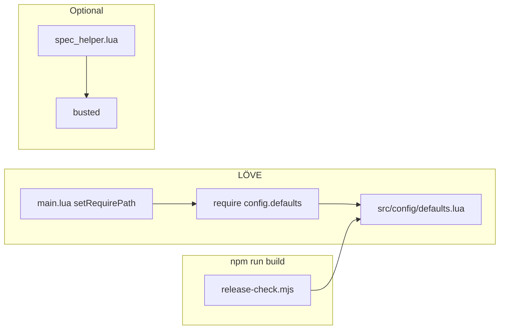

## Original task (source of truth)

Plan and fix the broken build due to missing module `config.defaults` (pipeline slice). The shipped game **also** satisfies the broader “Moles” product scope documented in **[CODING_NOTES.md](./CODING_NOTES.md)** and **[README.md](./README.md)**.

---

## Requirements traceability

**Pipeline slice (meta):** **[REQUIREMENTS.md](./REQUIREMENTS.md)** (R1–R3) — `config.defaults` identification, integration, build verification.

**Product slice (R1–R11 narrative):** Use the **§15** table in this document for file-level mapping. Deviations, as-built notes, and suggestions already captured in **CODING_NOTES.md** must stay in sync when behavior changes.

<!-- requirements-traceability-linked -->

---

# DESIGN — Moles (LÖVE) + `config.defaults` integration

**Audience:** Coding Agent blueprint and human maintainers.

**Runtime:** LÖVE **11.4** per `conf.lua`; **11.5** has been smoke-tested as API-compatible for this project.

**Entry:** `main.lua` → `src/app.lua` (scene stack, letterboxed **1280×720**).

---

## 1. High-level architecture

### 1.1 Layers

| Layer | Role | Key paths |
|-------|------|-----------|
| **Bootstrap** | `require` path, LÖVE callbacks | `main.lua`, `conf.lua` |
| **App / scenes** | Stack, navigation, match lifecycle | `src/app.lua`, `src/scenes/*.lua` |
| **Input** | Shared KB+M vs dual gamepad | `src/input/input_manager.lua`, `keyboard_mouse.lua`, `gamepad.lua`, `util/gamepad_menu.lua` |
| **Simulation** | World, physics, terrain, damage, turns, weapons | `src/sim/*.lua`, `src/sim/weapons/*.lua` |
| **Data** | Match options, session scores | `src/data/match_settings.lua`, `session_scores.lua` |
| **Config** | Global tuning (physics, weapons, wind, colors) | `src/config/defaults.lua` (module name `config.defaults`) |
| **Presentation** | Camera, draws, HUD, SFX | `src/render/*.lua`, `src/ui/hud.lua`, `src/audio/sfx.lua` |

### 1.2 Session flow (scenes)

`menu` → `match_setup` → `play` (with `pause` overlay) → `match_end` → (new setup or title). Match end records session scores via `data.session_scores`.

### 1.3 Focus / audio

`love.focus` → `app.focus`: mute `love.audio` when the window loses focus.

---

## 2. `config.defaults` — root cause, layout, and maintenance

### 2.1 Status: **implemented**

The module is **not** optional: sim, render, and HUD `require("config.defaults")`. The failure mode was **path mismatch**, not missing content.

### 2.2 Root cause (normative)

```2:2:main.lua
love.filesystem.setRequirePath("src/?.lua;src/?/init.lua;" .. love.filesystem.getRequirePath())
```

LÖVE’s `require` substitutes `?` after **mapping dots in the module name to directory separators**. Hence `require("config.defaults")` resolves to **`src/config/defaults.lua`**, not a flat `src/config.defaults.lua`.

### 2.3 As-built file layout

| Path | Role |
|------|------|
| **`src/config/defaults.lua`** | Single source of truth for returned defaults table |
| **`spec/spec_helper.lua`** | Repo root probing + `package.preload["config.defaults"]` / `package.path` for busted |
| **`tools/release-check.mjs`** | **Required** list includes `src/config/defaults.lua` so `npm run build` fails if it disappears |

**Do not** reintroduce `src/config.defaults.lua`. **Do not** rename the Lua module string at call sites; keep `require("config.defaults")`.

### 2.4 Module contract (schema)

`require("config.defaults")` returns one table. Preserve existing keys when tuning; consumers include `world.lua`, `mole.lua`, `physics.lua`, `terrain.lua`, `terrain_gen.lua`, `sim/weapons/rocket.lua`, `grenade.lua`, `render/mole_draw.lua`, `terrain_draw.lua`, `ui/hud.lua`.

```lua
-- Shape (pseudocode; numeric fields tuned in-repo)
{
  cell, grid_w, grid_h, gravity, mole_radius, jump_speed, walk_speed, max_dt,
  weapon = {
    rocket_speed, rocket_radius, rocket_blast, rocket_damage,
    rocket_gravity_mul, rocket_ray_steps,
    grenade_speed_mul, grenade_fuse, grenade_blast, grenade_damage,
    grenade_bounce, grenade_unstick_px,
  },
  wind_force = { low, med, high },
  colors = { team1, team2, sky_top, sky_bot, dirt, dirt_dark, grass },
}
```

**Policy:** Match-specific toggles live in **`src/data/match_settings.lua`**. Do not stuff key-bind strings into `config.defaults` (physics / weapon numbers / palette only).

### 2.5 Verification

- `npm run build` → `tools/release-check.mjs` must list `src/config/defaults.lua`.
- Manual: `love .` from repo root loads past first `require("config.defaults")`.
- Optional: `busted` per **TESTING.md** (CLI Lua may differ from LÖVE; `spec_helper` bridges this).

---

## 3. Turn model (players + mole slots)

**Authoritative implementation:** `src/sim/turn_state.lua`.

**Rules (normative prose):**

1. **`end_turn` / `advance_after_turn`:** For the **current** `active_player` P, advance that player’s `mole_slot[P]` at least one step on the ring 1..5, then to the **next living** mole for P; then set `active_player` to the opponent.
2. **`sync_slots_to_living`:** After damage/death, callers (e.g. `world.update`) must resync slots so the active slot never points at a dead mole mid-turn.
3. **Timer:** If turn time limit &gt; 0, expiry calls `end_turn` (same path as manual end).

```66:91:src/sim/turn_state.lua
function M:advance_after_turn(moles)
  local p = self.active_player
  -- ... ring walk, pick next living slot for player p ...
  self.active_player = (p == 1) and 2 or 1
end

function M:end_turn(moles, settings)
  self._turn_limit = settings.turn_time_seconds or 0
  self:advance_after_turn(moles)
  self:sync_slots_to_living(moles)
  self.turn_time_left = self._turn_limit
end
```

**UX:** `play` shows a short **“Next: Player · Mole slot”** toast on turn handoff (not a separate `round_end` scene).

---

## 4. Weapons — full rocket and grenade (not stubs)

| Weapon | Behavior | Tuning |
|--------|----------|--------|
| **Rocket** | Fast segment sweep, mild gravity via `rocket_gravity_mul`, impact detonation, terrain carve, damage, SFX | `config.defaults.weapon` + `world` integration |
| **Grenade** | Arc, full gravity, timed **fuse**, bounce + `grenade_unstick_px`, explosion + terrain | Same |

**Registry:** `src/sim/weapons/registry.lua` defines weapon ids/order; `world.weapon_index` and HUD stay aligned with **`rocket`** / **`grenade`** entries.

**Wind:** `world` derives horizontal impulse from `match_settings.wind` and `config.defaults.wind_force`.

---

## 5. Input — normative as-built (resolves prior UX vs Designer drift)

This section is the **single** normative control spec for shared keyboard and gamepad. **`README.md`** and HUD help text should match this; older pipeline UX docs that disagree are **superseded** here.

### 5.1 Shared keyboard + mouse (`input_mode == "shared_kb"`)

**Implementation:** `src/input/keyboard_mouse.lua`.

**Rationale (from as-built):** Power uses **Z / X (P1)** and **I / K (P2)** instead of W/S vs Up/Down for power, to avoid clashes with **jump** and **menu navigation** on Up/Down.

**Per-turn owner:** Only the **active** player’s row receives movement / jump / aim deltas from keys; **mouse aim and LMB fire** route to the turn owner via `world` / input manager (consume flags).

| Player | Move L/R | Jump | Aim − / + | Power − / + | Cycle weapon | Fire | End turn |
|--------|----------|------|-----------|-------------|--------------|------|----------|
| **P1** (when active) | A / D | W or Space | Q / E | **Z / X** | Tab | F | G |
| **P2** (when active) | Left / Right | Up or Right Shift | [ / ] | **K / I** | Minus or Equals | See §5.1.1 | Backspace or Backslash |

**Weapon hotkeys (either player):** `1`/`2` → P1 weapon index; `,`/`.` → P2 weapon index (used when setting loadout / team weapon context — see code).

#### 5.1.1 P2 fire keys (including Enter)

P2 fire consumes on **`semicolon`**, **`rctrl`**, **`return`**, or **`kpenter`** (see `on_keypressed`).

**Known issue:** If future in-match UI uses **Enter** to confirm dialogs, route those keys **before** `keyboard_mouse.on_keypressed` or **narrow** this binding so UI owns Enter.

### 5.2 Dual gamepad (`input_mode == "dual_gamepad"`)

**Implementation:** `src/input/gamepad.lua`. Joystick order: `love.joystick.getJoysticks()[1]` → P1, `[2]` → P2.

| Control | Mapping |
|---------|---------|
| Move | Left stick X |
| Jump | **A** |
| Aim | Right stick → absolute aim angle when non-zero |
| Power | **Right trigger − left trigger** (analog) |
| Fire | **B** (edge-triggered via consume flag) |
| End turn | **Y** |
| Cycle weapon | **LB** or **RB** |

**Note:** Some older UX text assumed **RT to fire**; as-built uses **B** for discrete fire and **triggers for power** only — reliable on common XInput layouts.

### 5.3 Gamepad menus

Scenes **`menu`**, **`match_setup`**, **`match_end`**, **`pause`**: `gamepadpressed` + `util/gamepad_menu.lua` (D-pad / left stick + cooldown). **A** ≈ confirm, **B** ≈ back. **Match end:** **X** = new setup. **Map seed** entry remains **keyboard**-oriented in setup.

---

## 6. Match setup and data models

**UI:** `src/scenes/match_setup.lua` backed by **`src/data/match_settings.lua`**.

**Typical options:** `mole_max_hp`, first player (P1 / P2 / random), friendly fire, turn time limit (or off), map seed (blank → random), wind (`off` / `low` / `med` / `high`), `input_mode` (`shared_kb` / `dual_gamepad`). Roster size **5 moles per team** is fixed for this build (read-only in UI).

**Session scores:** `src/data/session_scores.lua` — wins per player and draws, **session only** (reset on quit); surfaced on menu, HUD, and match end.

---

## 7. HUD, polish, procedural audio

**HUD** (`src/ui/hud.lua`): Turn banner (player, team label, active slot, HP, phase, optional timer); session score chips; team vitality (aggregate HP, cap, living count, input mode, friendly-fire flag); weapon panel (registry-driven, selected weapon, power bar, **live grenade fuse**); wind hint; roster S1–S5 with HP and active outline; help strip per input mode.

**Visual polish:** Mole shadows, team ground ellipse, dim inactive team, active ring; rocket trail/glow; grenade fuse ring/spark/pulse and shadow; aim preview colors from weapon registry.

**Audio:** No bundled `assets/audio/*` yet. **`src/audio/sfx.lua`** uses **procedural** beeps for fire, explosion, UI. Replace internals of `sfx.init()` / generators with WAV/OGG loading later **without changing call sites**.

---

## 8. Procedural terrain and combat loop

- **Generation:** `src/sim/terrain_gen.lua` from `World.new` / `world.lua` using `map_seed` or random from settings.
- **Destruction / damage:** `src/sim/terrain.lua`, `damage.lua`; explosions carve terrain and apply knockback/damage with friendly-fire rules from settings.

---

## 9. File / directory structure (reference)

```
main.lua, conf.lua
src/app.lua
src/config/defaults.lua
src/audio/sfx.lua
src/data/match_settings.lua, session_scores.lua
src/input/input_manager.lua, keyboard_mouse.lua, gamepad.lua
src/render/camera.lua, mole_draw.lua, terrain_draw.lua
src/scenes/menu.lua, match_setup.lua, play.lua, pause.lua, match_end.lua
src/sim/world.lua, mole.lua, physics.lua, terrain.lua, terrain_gen.lua,
       damage.lua, turn_state.lua
src/sim/weapons/registry.lua, rocket.lua, grenade.lua
src/ui/hud.lua
src/util/*.lua
spec/*.lua, spec/spec_helper.lua
tools/release-check.mjs, gen_sprites.mjs
assets/sprites/*.png
```

New files should follow existing naming (`snake_case.lua`, `require` dotted paths mirroring folders under `src/`).

---

## 10. Dependencies and tooling

| Tool | Role |
|------|------|
| **LÖVE 11.4+** | Game runtime |
| **Node.js** | `npm run build` → file-presence gate |
| **Busted** (optional) | Unit tests; see **TESTING.md** |

---

## 11. Component responsibilities (summary)

| Component | Responsibility |
|-----------|----------------|
| `app.lua` | Scene stack, assets, fonts, global input, match quit → results |
| `world.lua` | Match tick, projectiles, wind, weapon firing, turn sync after damage |
| `turn_state.lua` | Turn timer, slot advancement, active mole resolution |
| `input_manager.lua` | Mode dispatch, consume flags, joystick lifecycle |
| `hud.lua` | All in-match overlays and help |
| `config/defaults.lua` | Authoritative numeric/color tuning for sim + render |

---

## 12. Deviations (pipeline wording vs repo) — incorporated

- **Rocket:** Full implementation (not a stub); **grenade** also complete (distinct trajectory, fuse, bounce).
- **Shared keyboard / power keys:** Z/X vs I/K as in §5.
- **Gamepad:** A jump, B fire, Y end turn, LB/RB cycle, triggers for power — §5.2.
- **Audio:** Procedural SFX until real clips exist — §7.

---

## 13. Follow-up suggestions (non-blocking)

- Optional dedicated **`round_end`** scene (1–2 s) in addition to turn toast.
- Load **`assets/audio/*`** when available; keep procedural fallback.
- Extract **`keymaps_shared.lua`** (+ optional rebinding UI).
- Optional **RT-edge fire** on gamepad once input buffering is unified.
- Terrain **canvas cache** if fill-rate becomes an issue.

---

## 14. Implementation notes for the Coding Agent

1. **Never** place defaults at `src/config.defaults.lua` — breaks LÖVE resolution.
2. After editing tuning, run **`npm run build`**; keep **`tools/release-check.mjs`** in sync if you add new hard dependencies.
3. When changing **controls**, update **`keyboard_mouse.lua` / `gamepad.lua`**, **HUD help**, and **`README.md`** together; treat **§5** as normative.
4. When adding **in-match UI** that uses **Enter**, audit **§5.1.1** conflict with P2 fire.
5. Turn logic changes must preserve **`advance_after_turn`** + **`sync_slots_to_living`** invariants (see §3).
6. New weapons: extend **`sim/weapons`**, **`registry`**, `world`, HUD, and **`config.defaults.weapon`** in one pass.

---

## 15. Requirements traceability tables

### 15.1 Pipeline slice — **[REQUIREMENTS.md](./REQUIREMENTS.md)**

| ID | Requirement | Status / pointer |
|----|-------------|------------------|
| R1 | Identify missing `config.defaults` | §2 root cause |
| R2 | Integrate module into build/layout | §2.3–2.4 implemented |
| R3 | Verify build | §2.5 + `release-check.mjs` |

### 15.2 Product slice (narrative R1–R11)

| ID | Topic | Primary implementation |
|----|-------|------------------------|
| R1 | Presentation / style | HUD, mole/projectile polish, `render/*`, procedural SFX |
| R2 | Rocket | `src/sim/weapons/rocket.lua` + `world.lua` |
| R3 | Grenade | `src/sim/weapons/grenade.lua` + fuse HUD |
| R4 | 2P local | `play.lua`, two teams, hotseat |
| R5 | Procedural maps | `terrain_gen.lua`, seed from `match_settings` |
| R6 | Session scores | `session_scores.lua`, menu / HUD / match end |
| R7 | Five moles / team | `World.new` / `mole.spawn_team` |
| R8 | Rotate turns / moles | `turn_state.lua` (§3) |
| R9 | Match variables | `match_setup.lua`, `match_settings.lua` |
| R10 | Shared KB+M | `keyboard_mouse.lua` (§5.1) |
| R11 | Dual gamepad | `gamepad.lua` (§5.2) + setup warnings if &lt;2 pads |

---

## 16. Verification flow (`config.defaults` + ship gate)



---

## 17. Success criteria (config slice)

- `require("config.defaults")` loads **`src/config/defaults.lua`** only.
- `npm run build` passes; deleting `src/config/defaults.lua` fails the release check.
- No duplicate defaults sources; call sites unchanged (`require("config.defaults")`).
